# **📘 Data Structures and Algorithms Syllabus Using Java**
*For High-Level Interviews (Google, Amazon, Netflix, etc.)*

---

## 🔹 **1. Basic Data Structures**

### 📖 **1.1 Arrays**
- Introduction to Arrays
- 1D and 2D Arrays
- Time and Space Complexities
- Array Manipulation Techniques
- Sliding Window Pattern

### 🔗 **1.2 Linked Lists**
- Singly Linked List
- Doubly Linked List
- Circular Linked List
- Detecting and Removing Cycles
- Reverse a Linked List

### 📚 **1.3 Stacks and Queues**
- Stack Implementation
- Queue Implementation
- Monotonic Stack/Queue
- Applications (Balanced Parentheses, Next Greater Element, etc.)

---

## 🌳 **2. Advanced Data Structures**

### 🌲 **2.1 Trees and Binary Search Trees**
- Binary Trees
- Binary Search Tree (BST) Operations
- Tree Traversal (Inorder, Preorder, Postorder)
- AVL Trees
- Red-Black Trees
- Tree Height and Depth Calculation

### 🏔 **2.2 Heaps**
- Min Heaps and Max Heaps
- Heap Implementation (Priority Queues)
- Heap Sort Algorithm
- Applications (Kth Largest Element, Median of Stream)

### 🔑 **2.3 Hashing and HashMaps**
- Hash Functions and Collisions
- Open Addressing
- Separate Chaining
- HashMap and HashSet in Java
- Applications (Anagrams, Two Sum Problem)

---

## 🕸 **3. Graph Algorithms**

### 🗂 **3.1 Graph Representation**
- Adjacency Matrix vs. Adjacency List
- Directed vs. Undirected Graphs
- Weighted vs. Unweighted Graphs

### 🔍 **3.2 BFS and DFS**
- Breadth-First Search (BFS)
- Depth-First Search (DFS)
- Applications (Shortest Path, Connected Components)
- Topological Sort (Kahn's Algorithm, DFS Approach)

### 🛤 **3.3 Shortest Path Algorithms**
- Dijkstra's Algorithm
- Bellman-Ford Algorithm
- Floyd-Warshall Algorithm
- A* Search Algorithm

### 🌉 **3.4 Minimum Spanning Tree (MST)**
- Prim’s Algorithm
- Kruskal’s Algorithm
- Union-Find/Disjoint Sets

---

## 🔀 **4. Sorting Algorithms**

### 🌀 **4.1 Comparison-Based Sorting**
- Bubble Sort
- Selection Sort
- Insertion Sort
- QuickSort
- Merge Sort

### 🏗 **4.2 Non-Comparison Based Sorting**
- Counting Sort
- Radix Sort
- Bucket Sort

---

## 🔄 **5. Recursion and Backtracking**

### 🔄 **5.1 Recursion**
- Basics of Recursion
- Recursive Tree and Subproblems
- Tail Recursion
- Memoization

### 🌌 **5.2 Backtracking**
- N-Queens Problem
- Subsets and Permutations
- Solving Puzzles (Sudoku, Crossword)

---

## ⚔️ **6. Divide and Conquer**
- Merge Sort
- QuickSort
- Maximum Subarray Problem (Kadane's Algorithm)
- Median of Two Sorted Arrays

---

## ⚡ **7. Greedy Algorithms**
- Activity Selection Problem
- Huffman Coding
- Minimum Coins Change Problem
- Job Sequencing with Deadlines

---

## 🎯 **8. Dynamic Programming**

### 🔄 **8.1 Basic DP Concepts**
- Memoization vs. Tabulation
- Overlapping Subproblems
- Longest Common Subsequence (LCS)
- 0/1 Knapsack Problem

### 🔧 **8.2 Advanced DP Problems**
- Longest Increasing Subsequence (LIS)
- Edit Distance Problem
- Matrix Chain Multiplication
- Maximum Product Subarray

---

## 🧮 **9. Mathematical Algorithms**
- Sieve of Eratosthenes (Prime Numbers)
- Euclidean Algorithm (GCD)
- Modular Arithmetic
- Fibonacci Series (Matrix Exponentiation)

---

## 🔢 **10. Bit Manipulation**
- Basic Bitwise Operations (AND, OR, XOR)
- Check if Power of Two
- Counting Set Bits
- Bit Masking

---

## 🏛 **11. System Design Concepts**

### 🏗 **11.1 Design Patterns**
- Singleton Pattern
- Factory Pattern
- Observer Pattern

### 🌐 **11.2 Scalability and Distributed Systems**
- Load Balancing
- Sharding
- Consistent Hashing

---

## 📑 **12. Interview Preparation Strategies**
- Solving Coding Problems on LeetCode, HackerRank
- Mock Interviews and Whiteboard Sessions
- Time and Space Complexity Analysis
- Practicing Behavioral Questions

---

# **📝 Conclusion**

This syllabus covers all the critical **Data Structures and Algorithms** concepts necessary to prepare for high-level interviews with companies like Google, Amazon, and Netflix. Focus on problem-solving, understanding the core principles, and applying these techniques to real-world scenarios to excel in coding interviews.


---
# NOTES HERE 
---

## 🔹 **1. Basic Data Structures**
---

### 🔍 **1.1 Overview of Data Structures**

A **Data Structure** is a way of organizing, managing, and storing data so that it can be accessed and modified efficiently. The choice of data structure can significantly affect the performance of a program.

### 🔍 **1.2 Key Components of Data Structures**
#### 1. **Basic Terminology**
- **Data**: Information that is processed or stored.
- **Data Type**: Defines the type of data (e.g., int, float, char).
- **Element**: A single item in a data structure.
- **Collection**: A group of data elements.

#### 2. **Types of Data Structures**
- **Linear Data Structures**
  - Arrays
  - Linked Lists
  - Stacks
  - Queues
- **Non-linear Data Structures**
  - Trees
  - Graphs
- **Hash-Based Structures**
  - Hash Tables

#### 3. **Operations on Data Structures**
- **Insertion**: Adding an element.
- **Deletion**: Removing an element.
- **Traversal**: Accessing each element.
- **Searching**: Finding an element.
- **Sorting**: Arranging elements.

---

## **Types of Data Structures**


### 🗂 **Key Components of Data Structures**:
- **Data**: The actual values or information stored.
- **Relations**: The relationships between different pieces of data.
- **Operations**: The methods to manipulate the data (insert, delete, update, retrieve).

---

### 🌐 **1.2 Types of Data Structures**

Data structures can be broadly classified into two categories:

### 1. **Linear Data Structures**:
- **Arrays**: Collection of elements identified by index or key.
- **Linked Lists**: A sequence of nodes, where each node contains data and a reference to the next node.
- **Stacks**: LIFO (Last In First Out) structure where the last added element is the first to be removed.
- **Queues**: FIFO (First In First Out) structure where the first added element is the first to be removed.

### 2. **Non-Linear Data Structures**:
- **Trees**: Hierarchical structures with nodes connected by edges.
- **Graphs**: A collection of nodes connected by edges, representing relationships.
- **Hash Tables**: A data structure that implements an associative array abstract data type, a structure that can map keys to values.

---

## 📊 **1.3 Importance of Data Structures**

Data structures are crucial for several reasons:
- **Efficiency**: Efficiently storing and retrieving data improves the overall performance of applications.
- **Organization**: Helps organize data in a way that makes it easier to manipulate.
- **Reusability**: Well-defined data structures can be reused across different programs and applications.
- **Data Management**: Facilitates easier data management and manipulation for complex data applications.

---

## 🌍 **1.4 Real-Time Uses and Applications**

Data structures are widely used in various real-time applications, such as:
- **Databases**: Use trees and hash tables for indexing and retrieval.
- **Web Browsers**: Use stacks for backtracking in history and queues for loading web pages.
- **Artificial Intelligence**: Use graphs for representing networks and trees for decision-making.
- **Operating Systems**: Use queues for process scheduling and linked lists for memory management.

---

## ⚙️ **1.5 What is an Algorithm?**

An **Algorithm** is a step-by-step procedure or formula for solving a problem. It is a sequence of instructions that defines how to perform a specific task or solve a particular issue.

### **1.6 Characteristics of Algorithms**:
- **Well-Defined Inputs and Outputs**: An algorithm should specify input parameters and expected outputs.
- **Finiteness**: An algorithm should terminate after a finite number of steps.
- **Effectiveness**: Each step of the algorithm must be basic enough to be carried out, ideally using a pen and paper.
- **Generality**: An algorithm should solve a general set of problems, not just a single instance.

---

## 🔍 **1.7 Why Use Algorithms?**

- **Efficiency**: Algorithms can help solve problems more quickly and with fewer resources.
- **Reusability**: Well-defined algorithms can be reused across different programs.
- **Clarity**: Clear algorithms make it easier to understand the problem-solving process.
- **Optimization**: Algorithms can be optimized to achieve better performance in terms of time and space complexity.

---

## 🔍 **1.7 What is Algorithm Complexity?**

**Algorithm Complexity** refers to the amount of computational resources (time and space) that an algorithm consumes as a function of the size of the input data. It provides a high-level understanding of the efficiency of an algorithm and helps compare the performance of different algorithms.

---

### 🌐 **1.8 Types of Complexity**

#### 1.8.1 **Time Complexity**
- Measures the total time an algorithm takes to complete as a function of the length of the input. It gives insight into how the runtime of an algorithm grows with input size.

#### 1.8.2 **Space Complexity**
- Measures the total memory space required by the algorithm as a function of the length of the input. It helps understand the memory overhead associated with executing the algorithm.

---

## ⏳ **1.9 What is Time Complexity?**

**Time Complexity** quantifies the amount of time an algorithm takes to run based on the size of the input data, typically denoted as **n**. It provides an upper bound on the running time as the input size grows.

### **1.9.1 Common Time Complexities**:
- **Constant Time (O(1))**: The running time does not change with the size of the input.
- **Linear Time (O(n))**: The running time increases linearly with the input size.
- **Quadratic Time (O(n²))**: The running time increases quadratically as the input size increases.
- **Logarithmic Time (O(log n))**: The running time grows logarithmically as the input size increases.
- **Exponential Time (O(2^n))**: The running time doubles with each additional input element.

---

## 🧮 **1.10 How to Calculate Time Complexity**

### **Steps to Analyze Time Complexity**:
1. **Identify the Basic Operations**: Determine the most time-consuming operation within the algorithm.
2. **Count the Operations**: Analyze loops and recursive calls to count how many times the basic operation is executed.
3. **Express in Big O Notation**: Use Big O notation to express the growth rate of the running time relative to the input size.

### **Example**:
For a loop that iterates through an array of size **n**:
```java
for (int i = 0; i < n; i++) {
    // Some constant-time operations
}
```
The time complexity is O(n) since the loop runs n times.

## 🧮 **1.11 Common Notations:**

- `O (Big O Notation):` Represents the upper bound of the time complexity. It provides the worst-case scenario.
- `Ω (Omega Notation):` Represents the lower bound of the time complexity. It provides the best-case scenario.
- `Θ (Theta Notation):` Represents a tight bound on the time complexity, indicating that the running time grows at the same rate in both upper and lower bounds.

**Example:**
- If an algorithm has a time complexity of O(n²) in the worst case and Ω(n) in the best case, we denote it as:

```text
O(n²) (worst-case)
Ω(n) (best-case)
Θ(n²) (average-case)
```
## 📈 **1.12 What is a Growth Function?**
A Growth Function describes how the running time or space requirements of an algorithm increase with respect to the input size n. It helps in visualizing and comparing the efficiency of algorithms.

#### Graphing Growth Functions:Growth Functions for Different Types of Equations

A graph can illustrate how different algorithms scale as input size increases, providing insight into their performance.

A. **Constant Time (O(1))**
- The algorithm’s running time remains constant regardless of input size.
B. **Linear Time (O(n))**
- The running time increases linearly with input size.
C. **Quadratic Time (O(n²))**
- The running time increases quadratically with input size.
D. **Logarithmic Time (O(log n))**
- The running time grows logarithmically as input size increases.
E. **Exponential Time (O(2^n))**
- The running time doubles with each additional input element.

### Example Growth Rates:


### 📈 A.Growth Function for Constant Time (O(1))

##### Constant Time Complexity Diagram


#### Explanation:
- **Input Size (n)**: This represents the size of the input.
- **O(1)**: This indicates that the time taken by the algorithm remains constant, regardless of the input size.

#### Example : Accessing an Element in an Array
**Scenario:** Suppose you have an array of integers, and you want to access the first element of the array.

```java
int[] array = {1, 2, 3, 4, 5};
int firstElement = array[0]; // This operation takes constant time O(1)
```
In this case, regardless of the size of the array, accessing the first element will always take the same amount of time.


### 📈 B.Linear Time (O(n))

#### 📊 Linear Time Complexity Diagram


```plaintext
    Time Taken
        |
        |          *
        |        *
        |      *
        |    *
        |  *
        |*
        +--------------------> Input Size (n)
        0   1   2   3   4   5
```
 (Time vs Input Size for Linear Time Complexity (O(n)))

### Explanation:
- In the **chart**:
  - The **Y-axis** represents the **Time Taken**.
  - The **X-axis** represents the **Input Size (n)**.
  - Each asterisk (`*`) denotes a point where the time taken increases linearly with respect to the input size.


In Linear Time Complexity, the time taken for the operation increases directly proportional to the increase in input size (n). For example, if you need to process every element in an array, the time increases as the array size grows.

#### **Example: Traversing an Array**

**Scenario:** Suppose you have an array of integers, and you want to traverse the entire array. The time taken for this operation increases linearly as the input size increases.

```java
int[] array = {1, 2, 3, 4, 5};
for (int i = 0; i < array.length; i++) {
    System.out.println(array[i]); // This operation takes linear time O(n)
}
```
In this case, if the size of the array doubles, the time taken to traverse it also doubles.


### 📈 C.Quadratic Time (O(n²))
In Quadratic Time Complexity, the time taken grows proportionally to the square of the input size. For example, if you have an input size  𝑛:

- For 𝑛=1: Time = 1² = 1
- For 𝑛=2: Time = 2² = 4
- For 𝑛=3: Time = 3² = 9
- For 𝑛=4: Time = 4² = 16
- For 𝑛=5: Time = 5² = 25

#### 📊 Quadratic Time Complexity Diagram


 (Time vs Input Size for Quadratic Time Complexity (O(n²)))

### Explanation:

Input Size (n): Represents the size of the input.
Time (O(n²)): Represents the time taken which grows quadratically as the input size increases.

### 📈 D.Logarithmic Time (O(log n))

##### 📉Time vs Input Size for Logarithmic Time Complexity (O(log n))

```mermaid
graph TD
    A["Input Size (n)"] --> B["O(log n)"]
    B --> C["O(log 1) = 0"]
    B --> D["O(log 2) ≈ 1"]
    B --> E["O(log 4) ≈ 2"]
    B --> F["O(log 8) ≈ 3"]
    B --> G["O(log 16) ≈ 4"]
    B --> H["O(log 32) ≈ 5"]
    B --> I["O(log 64) ≈ 6"]
    B --> J["O(log 128) ≈ 7"]
    
    %% Styling for better visibility
    style A fill:#fff,stroke:#333,stroke-width:2px;
    style B fill:#fff,stroke:#333,stroke-width:2px;
    style C fill:#fff,stroke:#333,stroke-width:2px;
    style D fill:#fff,stroke:#333,stroke-width:2px;
    style E fill:#fff,stroke:#333,stroke-width:2px;
    style F fill:#fff,stroke:#333,stroke-width:2px;
    style G fill:#fff,stroke:#333,stroke-width:2px;
    style H fill:#fff,stroke:#333,stroke-width:2px;
    style I fill:#fff,stroke:#333,stroke-width:2px;
    style J fill:#fff,stroke:#333,stroke-width:2px;
    style J fill:#fff,stroke:#333,stroke-width:2px;
```




### Explanation:
- **Input Size (n)**: This node represents various sizes of input for which the time complexity is being calculated.
- **Time T(n)**: This node shows the logarithmic time complexity values.
- The time complexity values are calculated using logarithmic growth based on the input size.

### Calculated Values:
- O(log 1) = 0
- O(log 2) ≈ 1
- O(log 4) ≈ 2
- O(log 8) ≈ 3
- O(log 16) ≈ 4
- O(log 32) ≈ 5
- O(log 64) ≈ 6
- O(log 128) ≈ 7

#### Example of Logarithmic Time Complexity (O(log n))

**1. Binary Search Algorithm**

- **Problem Statement:**
Given a sorted array, find the position of a target value. If the target exists, return its index; otherwise, return -1.
- **Binary Search Steps:**
1. **Initial Setup:** Set two pointers, low at the beginning (0) and high at the end (n-1) of the array.
2. Iterate until low is less than or equal to high:
    - Calculate the mid index as (low + high) / 2.
    - If the target value is equal to the element at mid, return mid.
    - If the target value is less than the element at mid, update high to mid - 1.
    - If the target value is greater than the element at mid, update low to mid + 1.
3. If not found: Return -1.

-**Time Complexity Analysis:**
- In each iteration, the size of the search space is halved.
- Thus, if the array has n elements, the maximum number of iterations needed to find the target
 is log2𝑛log2n ,leading to a time complexity of 𝑂(log𝑛).

**Example Code(Java)**
```java
public class BinarySearch {
    public static int binarySearch(int[] arr, int target) {
        int low = 0;
        int high = arr.length - 1;

        while (low <= high) {
            int mid = low + (high - low) / 2; // Prevents overflow

            if (arr[mid] == target) {
                return mid; // Target found
            } 
            else if (arr[mid] < target) {
                low = mid + 1; // Search right half
            } 
            else {
                high = mid - 1; // Search left half
            }
        }
        return -1; // Target not found
    }

    public static void main(String[] args) {
        int[] sortedArray = {1, 3, 5, 7, 9, 11, 13, 15, 17, 19};
        int target = 7;
        int result = binarySearch(sortedArray, target);
        if (result != -1) {
            System.out.println("Element found at index: " + result);
        } else {
            System.out.println("Element not found.");
        }
    }
}
```
**Explanation of the Code:**
- The binarySearch method takes a sorted array and a target value as input.
- It initializes pointers low and high to the beginning and end of the array, respectively.
- The loop continues until the pointers meet, effectively halving the search space in each iteration.
- Depending on the comparison of the target with the middle element, it adjusts the low or high pointers accordingly.

**Real-World Applications:**
- Finding an item in a large database where records are indexed.
- Navigating through a hierarchical structure like a file system.
- Searching in sorted data sets like phone books, dictionaries, etc.
### 📈 E.Exponential Time (O(2^n))
Exponential time complexity describes algorithms whose running time doubles with each additional input element. This typically occurs in recursive algorithms that solve problems by breaking them down into smaller subproblems.

## Characteristics

- **Growth Rate**: Extremely rapid growth as the input size increases.
- **Common in**: Problems involving combinations, permutations, and certain recursive algorithms (e.g., solving the Fibonacci sequence recursively).

## Calculated Values

For a function with O(2^n) complexity, the time taken grows exponentially based on the size of the input. Here are a few calculated values:

| Input Size (n) | Time (O(2^n)) |
|----------------|----------------|
| 0              | 1              |
| 1              | 2              |
| 2              | 4              |
| 3              | 8              |
| 4              | 16             |
| 5              | 32             |
| 6              | 64             |
| 7              | 128            |
| 8              | 256            |
| 9              | 512            |
| 10             | 1024           |
| 20             | 1,048,576      |

## Example Problem: Fibonacci Sequence

A classic example of an exponential time algorithm is the naive recursive calculation of the Fibonacci sequence, defined as:
- F(0) = 0
- F(1) = 1
- F(n) = F(n-1) + F(n-2) for n > 1

## Example Code in Python

```python
def fibonacci(n):
    if n <= 1:
        return n
    return fibonacci(n-1) + fibonacci(n-2)

# Plotting the time complexity
import matplotlib.pyplot as plt
import time

input_sizes = list(range(0, 20))  # Input sizes from 0 to 19
times = []

for n in input_sizes:
    start_time = time.time()
    fibonacci(n)
    end_time = time.time()
    times.append(end_time - start_time)

plt.plot(input_sizes, times, marker='o')
plt.title("Exponential Time Complexity of Fibonacci Function")
plt.xlabel("Input Size (n)")
plt.ylabel("Time (seconds)")
plt.yscale('log')  # Using log scale for better visibility
plt.grid()
plt.show()

```

#### Explanation of the Python Code
- **Function Definition:** The fibonacci function computes the Fibonacci number recursively.
- **Time Measurement:** We use the time module to measure how long it takes to compute the Fibonacci number for various input sizes.
-**Plotting:** The matplotlib library is used to create a line plot. The y-axis is set to a logarithmic scale to better visualize the rapid growth of time.

#### Example Code in Java

```java
public class Fibonacci {
    public static void main(String[] args) {
        int inputSize = 20; // Change this value to test with different input sizes
        for (int n = 0; n <= inputSize; n++) {
            long startTime = System.nanoTime();
            System.out.println("F(" + n + ") = " + fibonacci(n));
            long endTime = System.nanoTime();
            long duration = endTime - startTime;
            System.out.println("Time taken: " + duration + " ns");
        }
    }

    public static int fibonacci(int n) {
        if (n <= 1) {
            return n;
        }
        return fibonacci(n - 1) + fibonacci(n - 2);
    }
}
```
**Explanation of the Java Code**
1. **Main Method:** The main method iterates through input sizes from 0 to a specified size (20 in this case).
2. **Timing Execution:** The time to compute each Fibonacci number is measured using System.nanoTime().
3. **Recursive Function:** The fibonacci method implements the same naive recursive approach as in Python.

#### Real-World Applications

1. **Combinatorial Problems:** Problems involving generating all subsets or permutations (e.g., the Traveling Salesman Problem).
2. **Game Theory:** Minimax algorithms in game playing can have exponential time complexity in their naive implementations.
3. **Cryptography:** Certain cryptographic algorithms can exhibit exponential growth due to the complexity of brute-forcing keys.


### Exercises to Calculate Time Complexity :

**Exercise 1:** Simple Loop
**Problem:** Consider the following code snippet:


**Java**
```java
public class SimpleLoop {
    public static void simpleLoop(int n) {
        for (int i = 0; i < n; i++) {
            System.out.println(i);
        }
    }
    public static void main(String[] args) {
        simpleLoop(5);
    }
}
```
**Question:** What is the time complexity of this code?

**Solution:**
1. **Identify the Loop:** The for-loop runs from 0 to n-1.
2. **Count Iterations:** The loop executes n times.
3. **Operations Per Iteration:** The println statement takes constant time O(1).
4. **Total Time Complexity:**

            Total Time =  𝑛⋅𝑂(1) = 𝑂(𝑛)

**Time Complexity: O(n)**
---


**Exercise 2:** Nested Loops
**Problem:** Consider the following code snippet:


**Java**
```java
public class NestedLoops {
    public static void nestedLoops(int n) {
        for (int i = 0; i < n; i++) {
            for (int j = 0; j < n; j++) {
                System.out.println("i: " + i + ", j: " + j);
            }
        }
    }

    public static void main(String[] args) {
        nestedLoops(3);
    }
}
```
**Question:** What is the time complexity of this code?

**Solution:**
1. **Outer Loop Analysis:** The outer loop runs n times.
2. **Inner Loop Analysis:** For each iteration of the outer loop, the inner loop also runs n times.
3. **Count Total Iterations:** The total iterations are:
        n⋅n = n²
4. **Operations Per Iteration:**
            Total Time=n²⋅O(1)=O(n²)

**Time Complexity: O(n²)**


**Exercise 3:** Logarithmic Complexity (Binary Search)
**Problem:** Consider the following code snippet:


**Java**
```java
public class BinarySearch {
    public static int binarySearch(int[] arr, int target) {
        int low = 0, high = arr.length - 1;
        while (low <= high) {
            int mid = (low + high) / 2;
            if (arr[mid] == target) return mid;
            if (arr[mid] < target) low = mid + 1;
            else high = mid - 1;
        }
        return -1;
    }

    public static void main(String[] args) {
        int[] arr = {1, 2, 3, 4, 5};
        int index = binarySearch(arr, 3);
        System.out.println("Index of 3: " + index);
    }
}
```
**Question:** What is the time complexity of this binary search algorithm?

**Solution:**
1. **Identify the Loop:** The while-loop continues while low is less than or equal to high.
2. **Analyze Iteration Reduction:** Each iteration halves the search space.
3. **Count Iterations:** The number of iterations required to reduce the search space from n to 1 is:
        log₂(n)
4. **Operations Per Iteration:** 
    The operations inside the loop (comparisons and arithmetic) take constant time O(1).
**Time Complexity: O(log n)**
    Total Time=O(logn)
---

**Exercise 4:** Conditional Statements in Nested Loops

**Problem:** Consider the following code snippet:


**Java**
```java
public class ConditionalNestedLoops {
    public static void conditionalNestedLoops(int n) {
        for (int i = 0; i < n; i++) {
            for (int j = 0; j < n; j++) {
                if (i == j) {
                    System.out.println(i);
                }
            }
        }
    }

    public static void main(String[] args) {
        conditionalNestedLoops(3);
    }
}
```
**Question:** What is the time complexity of this code?

**Solution:**
1. **Outer Loop Analysis:** The outer loop runs n times.
2. **Inner Loop Analysis:** For each iteration of the outer loop, the inner loop runs n times.
3. **Count Total Iterations:** The total iterations are:
        n⋅n=n²
4. **Condition Inside the Loop:**
    The condition if (i == j) takes constant time O(1). The println statement executes only when the condition is true, which occurs n times (once for each i).

**Total Time Complexity:**
        Total Time=n²⋅O(1)=O(n²)

**Time Complexity: O(n²)**
---

**Exercise 5:** Linear Complexity with Additional Operations

**Problem:** Consider the following code snippet:


**Java**
```java
public class AdditionalOperations {
    public static void additionalOperations(int n) {
        for (int i = 0; i < n; i++) {
            for (int j = 0; j < n; j++) {
                System.out.println("i: " + i + ", j: " + j);
            }
            System.out.println("End of iteration: " + i);
        }
    }

    public static void main(String[] args) {
        additionalOperations(3);
    }
}
```
**Question:** What is the time complexity of this code?

**Solution:**
1. **Outer Loop Analysis:** The outer loop runs n times.
2. **Inner Loop Analysis:** The inner loop runs n times for each iteration of the outer loop.
3. **Count Total Iterations:** The total iterations for the nested loop:
        n⋅n=n²
4. **Additional Operations:**
    The println statement outside the inner loop executes n times, which is O(n).

**Total Time Complexity:**
        Total Time=n² + n =O(n²)

**Time Complexity: O(n²)**

---------

## Interview Questions

**Q1. What is time complexity?**

**Answer:** Time complexity is a computational complexity that describes the amount of time an algorithm takes to complete based on the size of the input. It is usually expressed using Big O notation.

**Q2. What is Big O notation?**

**Answer:** Big O notation is a mathematical representation used to describe the upper bound of the time complexity of an algorithm. It provides a way to express how the runtime grows relative to the input size

**Q3. How do you calculate time complexity?**

**Answer:** To calculate time complexity, analyze the algorithm's structure, including loops, recursive calls, and conditional statements. Count the number of basic operations as a function of the input size 𝑛.

**Q4. What is the time complexity of a single loop that runs from 1 to 𝑛?**

**Answer:** The time complexity is 𝑂(𝑛).

**Q5. What is the time complexity of nested loops?**

**Answer:** If you have two nested loops, each running from 1 to 
𝑛, the time complexity is 𝑂(𝑛²).

**Q6. What is the time complexity of a binary search algorithm?**

**Answer:** The time complexity of a binary search algorithm is 
𝑂(log 𝑛).

**Q7. What is the time complexity of accessing an element in an array?**

**Answer:** The time complexity for accessing an element in an array is 𝑂(1) (constant time).


**Q8. What is the time complexity of inserting an element in a sorted array?**

**Answer:** The time complexity for inserting an element in a sorted array is 𝑂(𝑛) because you may need to shift elements to maintain order.

**Q9. What is the time complexity of searching for an element in an unsorted array?**

**Answer:** The time complexity for searching an element in an unsorted array is 𝑂(𝑛).


**Q10. How does the time complexity of quicksort compare to that of mergesort?**

**Answer:** The average time complexity of quicksort is 
𝑂(𝑛log𝑛), while mergesort has a guaranteed time complexity of 𝑂(𝑛log𝑛) in all cases.


**Q11. What is the time complexity of finding the maximum element in an array?**

**Answer:** The time complexity for finding the maximum element in an array is 𝑂(𝑛).


**Q12. What is the time complexity of bubble sort?**

**Answer:** The time complexity of bubble sort is 
𝑂(𝑛2) in the average and worst cases.

**Q13. What is the time complexity of selection sort?**

**Answer:** The time complexity of selection sort is 
𝑂(𝑛2) in the average and worst cases.

**Q14. What is the time complexity of insertion sort?**

**Answer:** The time complexity of insertion sort is 
𝑂(𝑛2)in the average and worst cases but 𝑂(𝑛) in the best case when the array is already sorted.

**Q15. What is the time complexity of a recursive function that divides the problem in half each time?**

**Answer:** The time complexity of such a recursive function is typically 𝑂(log𝑛), such as in binary search.

--- 


## 1.1 Arrays
- Introduction to Arrays
- 1D and 2D Arrays
- Time and Space Complexities
- Array Manipulation Techniques
- Sliding Window Pattern

## A. Introduction to Arrays

### What is an Array?

An array is a data structure that stores a fixed-size sequence of elements of the same type. It allows for efficient access and manipulation of data through indexed positions. Arrays are fundamental in programming and serve as the basis for many other data structures.

### Key Characteristics of Arrays:

**1.Fixed Size:** Once an array is created, its size cannot be changed. This means you need to know the number of elements in advance.

**2.Homogeneous Elements:** All elements in an array must be of the same data type (e.g., integers, characters, floats).

**3.Indexed Access:** Each element can be accessed directly using its index, which starts from zero. This allows for quick retrieval of data.

**4.Contiguous Memory:** Arrays are stored in contiguous memory locations, which allows for efficient access and traversal.

### Types of Arrays

**1.One-Dimensional Arrays:** 
  A simple list of elements.

  Example: int[ ] numbers = {1, 2, 3, 4, 5};

**2.Multi-Dimensional Arrays:** 
  Arrays of arrays, allowing for more complex data structures, such as matrices.

  Example: int[ ][ ] matrix = { {1, 2}, {3, 4} };

**3.Dynamic Arrays:** 
  While traditional arrays have a fixed size, dynamic arrays (like Python's lists or Java's ArrayList) can grow and shrink in size as needed.


### Basic Operations on Arrays 

**1. Initialization:** Defining an array and allocating memory.

  Example in Java: int[] arr = new int[5];

**2. Accessing Elements:** Retrieving elements using their index.

  Example: int x = arr[0]; // Access first element

**3. Updating Elements:** Changing the value of a specific element.

  Example: arr[2] = 10; // Update third element

**4. Iterating Over Arrays:** Using loops to traverse and manipulate elements.

  ```java
  for (int i = 0; i < arr.length; i++) {
    System.out.println(arr[i]);
}
```
**5. Searching: :** Finding an element within an array, typically using linear or binary search algorithms.

**6.Sorting:** Arranging elements in a specific order (ascending or descending).

### Advantages of Arrays

- **Fast Access:** Constant time complexity 𝑂(1) for accessing elements by index.

- **Memory Efficiency:** Contiguous memory allocation reduces overhead compared to other data structures.

- **Simplicity:** Easy to understand and use, making them suitable for various applications.

### Disadvantages of Arrays

- **Fixed Size:** Cannot easily change the size after creation.

- **Inefficient Insertions/Deletions:** Adding or removing elements (especially in the middle) can be time-consuming, as it may require shifting other elements.

- **Homogeneous Data:** Can only store one type of data, which may limit flexibility.

## B. 1D and 2D Arrays


## C. Time and Space Complexities

## D. Array Manipulation Techniques

## E. Sliding Window Pattern