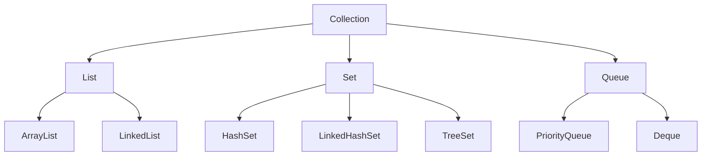
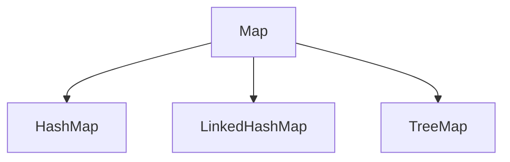

# 📚 Java Collection Framework 

> **Objective**: This syllabus covers the latest Java Collection Framework topics, emphasizing data structures, operations, and best practices for coding interviews and projects.

---

## 📌 Table of Contents
1. [Overview of Java Collection Framework](#overview-of-java-collection-framework)
2. [Core Interfaces](#core-interfaces)
3. [Implementations of Interfaces](#implementations-of-interfaces)
4. [Collections Utility Class](#collections-utility-class)
5. [Concurrency in Collections](#concurrency-in-collections)
6. [Best Practices and Interview Tips](#best-practices-and-interview-tips)

---

### 📘 Overview of Java Collection Framework
The **Java Collection Framework** is a unified architecture for representing and manipulating collections, enabling algorithms for sorting, searching, and manipulation.


## 🧩 Core Interfaces

| **Interface** | **Description**                                |
|---------------|-----------------------------------------------|
| Collection    | Base of the Collection hierarchy              |
| List          | Ordered, allows duplicates                    |
| Set           | Unordered, unique elements                    |
| Queue         | FIFO, elements added and removed at ends      |
| Deque         | Double-ended queue                            |
| Map           | Key-value pairs, unique keys                  |


## 🏗️ Implementations of Interfaces

#### 1. List Implementations
- **ArrayList:** Dynamic array, fast for accessing elements.
- **LinkedList:** Doubly linked list, fast for insertion and deletion.
#### 2. Set Implementations
- **HashSet:** Unordered, no duplicates, backed by hash table.
- **LinkedHashSet:** Ordered version of HashSet.
- **TreeSet:** Sorted set using Red-Black tree.
#### 3. Queue Implementations
- **PriorityQueue:** Natural ordering or custom comparator.
- **Deque:** Double-ended queue for adding/removing from both ends.
#### 4. Map Implementations
- **HashMap:** Key-value pairs, unsorted.
- **LinkedHashMap:** Maintains insertion order.
- **TreeMap:** Sorted keys using Red-Black tree.


## 📂 Collections Utility Class

The Collections class provides static utility methods for collection operations, including:

- Sorting, Searching, and Shuffling
- Min/Max
- Synchronized Wrappers for thread safety
- Immutable Collections with unmodifiableCollection

```mermaid
flowchart LR
    Collections -->|"sort"| Sorted
    Collections -->|"search"| Index
    Collections -->|"synchronizedCollection"| ThreadSafeCollection
    Collections -->|"unmodifiableCollection"| ImmutableCollection
    Collections -->|"min/max"| MinMax
