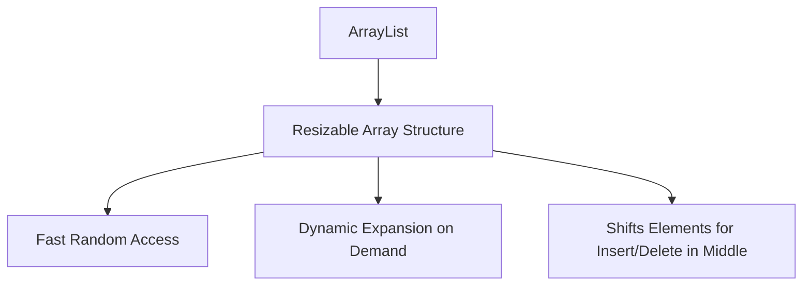
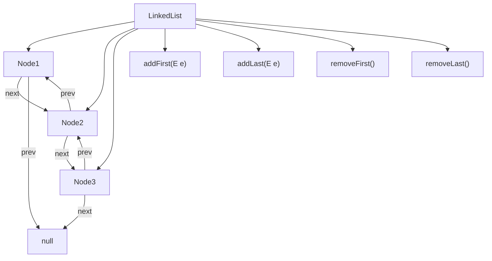
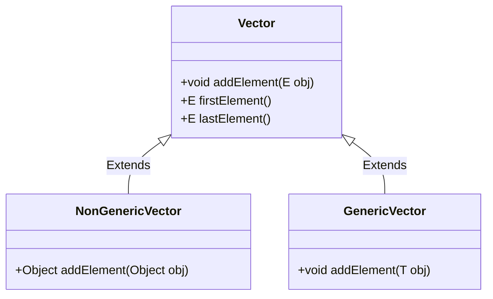

# 🗃️ Java Collection Framework


## 📌 1. Introduction to Java Collection Framework

- 🌐 **Overview**: Understanding what the Java Collection Framework is and why it’s essential.
- 📝 **Advantages**: Improved performance, code reusability, ease of maintenance.
- 🏛️ **Hierarchy**: Overview of the core interfaces:
  - **Collection**: The root of the collection hierarchy.
  - **Map**: Key-value pairs, not part of the `Collection` interface.

---

## 📖 2. Core Collection Interfaces and their Characteristics

| **Interface**    | **Description**                                   |
|------------------|---------------------------------------------------|
| 📦 `Collection`  | Root of the collection framework hierarchy.       |
| 📋 `List`        | Ordered collection, allows duplicates.            |
| 🧩 `Set`         | Unordered, unique elements only.                  |
| 📥 `Queue`       | FIFO order, typical for queue operations.         |
| 🔄 `Deque`       | Double-ended queue, supports both ends.           |
| 🗂️ `Map`         | Key-value pairs with unique keys.                 |

---

## 📂 3. List Interface and its Implementations

1. **ArrayList**
   - 📚 **Overview**: Resizable array-based implementation.
   - 🟢 **Pros**: Fast random access, ideal for retrieval operations.
   - 🔴 **Cons**: Slower insertions/deletions in the middle of the list.
   - 🔒 **Thread Safety**: Not synchronized (use `Collections.synchronizedList()`).
   - 🕒 **Complexity**: `O(1)` for `get()`, `O(n)` for `remove()`.

2. **LinkedList**
   - 🌐 **Overview**: Doubly-linked list, efficient for adding/removing from ends.
   - 📥 **Extra Operations**: Implements `Deque`, supports stack-like operations.
   - 🕒 **Complexity**: `O(n)` for random access; `O(1)` for additions/removals at ends.

3. **Vector**
   - 🔒 **Overview**: Synchronized version of `ArrayList`, slower but thread-safe.
   - 📊 **Methods**: `addElement()`, `firstElement()`, `lastElement()`.
   
4. **Stack**
   - 📑 **Overview**: Extends `Vector` for LIFO operations.
   - 📝 **Key Methods**: `push()`, `pop()`, `peek()`.

---

## 🧩 4. Set Interface and its Implementations

1. **HashSet**
   - 🔹 **Overview**: Unordered, unique elements, backed by `HashMap`.
   - 🚀 **Performance**: `O(1)` for basic operations.

2. **LinkedHashSet**
   - 📋 **Overview**: Maintains insertion order, a blend of `HashSet` and `LinkedList`.

3. **TreeSet**
   - 📐 **Overview**: Sorted set, backed by a Red-Black tree (implements `NavigableSet`).
   - 🕒 **Complexity**: `O(log n)` for add, remove, and contains.

4. **EnumSet**
   - 🗂️ **Specialized Set**: For `enum` types, highly efficient and optimized.

---

## 🔑 5. Map Interface and its Implementations

1. **HashMap**
   - ⚡ **Overview**: Unordered key-value pairs, allows one `null` key.
   - 🔍 **Performance**: Average `O(1)` for `get()` and `put()` operations.

2. **LinkedHashMap**
   - 📐 **Order-Preserving**: Maintains insertion order, useful for cache mechanisms.

3. **TreeMap**
   - 📈 **Sorted Map**: Sorts keys by natural ordering or custom comparator.
   - 🕒 **Complexity**: `O(log n)` for basic operations.

4. **Hashtable**
   - 🔒 **Thread-Safe**: Synchronized map, no `null` keys or values.

5. **IdentityHashMap**
   - 🔄 **Comparison**: Uses `==` for comparing keys instead of `equals()`.

6. **WeakHashMap**
   - 🧹 **Garbage Collection**: Entries are removed when keys have no references.

7. **ConcurrentHashMap**
   - 🧵 **Concurrency Optimized**: Thread-safe map optimized for concurrent access.

8. **EnumMap**
   - ⚙️ **Enum-Specific**: High-performance map for enum keys only.

---

## 📑 6. Queue Interface and its Implementations

1. **PriorityQueue**
   - 📐 **Sorted Queue**: Orders elements by natural order or custom comparator.
   - 📥 **Use Case**: For implementing min-heap or max-heap structures.

2. **ArrayDeque**
   - 🔄 **Double-Ended Queue**: Ideal for both stack and queue operations.

---

## 🛠️ 7. Collections Utility Class

1. **Sorting**: `Collections.sort()` - Sorts a list using natural order or comparator.
2. **Searching**: `Collections.binarySearch()` - Searches sorted lists.
3. **Synchronized Collections**: `Collections.synchronizedList`, `synchronizedMap`.
4. **Unmodifiable Collections**: `Collections.unmodifiableList`, `unmodifiableSet`.
5. **Min/Max**: `Collections.min()`, `Collections.max()`.
6. **Frequency**: `Collections.frequency()` - Counts occurrences of an element.
7. **Shuffle**: `Collections.shuffle()` - Randomizes list order.

---

## 🕸️ 8. Concurrency in Collections

1. **ConcurrentHashMap**:
   - 🔄 **Mechanism**: Segment-based locking, highly efficient for multi-threaded access.

2. **CopyOnWriteArrayList & CopyOnWriteArraySet**:
   - 🔒 **Use Case**: Ideal for concurrent read-heavy collections.

3. **BlockingQueue Interfaces**:
   - ⏳ `SynchronousQueue`, `ArrayBlockingQueue`, `LinkedBlockingQueue`.
   - 🎯 **Pattern**: Commonly used in producer-consumer scenarios.

---

## 🌟 9. Special-Purpose Collections

1. **NavigableSet and NavigableMap**:
   - 🧭 **Navigation**: Supports methods like `lower()`, `higher()`, for navigable operations.

2. **Properties Class**:
   - 🔧 **Configuration Management**: Key-value storage for configuration settings.

---

## 💡 10. Best Practices and Patterns

- **Choosing the Right Collection**: Based on performance, thread safety, memory.
- **Fail-Fast vs. Fail-Safe**:
   - 🚫 **Fail-Fast**: Modifications throw `ConcurrentModificationException` (e.g., `ArrayList`).
   - ✔️ **Fail-Safe**: Works on a copy, no exceptions (e.g., `CopyOnWriteArrayList`).

---

## 🎓 11. Java Collections for Interview Preparation

- **Common Problems**:
  - 🧩 Finding duplicates, common elements, sorting custom objects.
- **Optimization**:
  - ⚙️ Use `HashMap` over nested loops, `TreeMap` for ordered retrieval.
  
---

## 🏆 12. Practical Examples and Exercises

1. **Custom Collection Classes**:
   - 🧑‍💻 Extend `AbstractCollection` to build a custom collection class.
   
2. **Case Study**:
   - 📈 **Inventory Management**: Using `HashMap`, `LinkedList`, and `PriorityQueue`.
  
3. **Problem Solving**:
   - 🔍 Finding most frequent elements.
   - 🗑️ Removing duplicates in a collection.
   - 📑 Building an LRU Cache using `LinkedHashMap`.

---


# 🗃️ Introduction to Java Collection Framework

---

## 🌐 Overview: What is the Java Collection Framework?

The **Java Collection Framework** is a standardized architecture in Java that provides a set of interfaces and classes for storing, retrieving, manipulating, and communicating aggregate data. 

This framework is essential for efficient data handling in Java and significantly improves performance, code reusability, and maintainability.

### Key Points:
- 🌳 **Collection Framework Structure**: A unified architecture for representing and manipulating collections, which includes lists, sets, queues, and maps.
- 📦 **Core Interfaces**: Defines the hierarchy for various data structures, like `Collection`, `List`, `Set`, and `Map`.
- 🏗️ **Implementation Classes**: Each interface has multiple implementations optimized for specific use cases.

---

## 📝 Advantages of the Java Collection Framework

1. **Improved Performance** 🏎️: Provides highly optimized implementations of common data structures, which boost application performance.
2. **Code Reusability** 🔁: Standard interfaces and classes enable developers to reuse code across projects and environments.
3. **Ease of Maintenance** 🔧: Reduces the complexity of data management, making code easier to maintain and debug.

---

## 🏛️ Hierarchy of the Java Collection Framework

The Java Collection Framework organizes various data structures into a clear hierarchy of interfaces, with each interface representing a specific type of collection behavior. Here are the two main categories of interfaces:

### 1. Collection Interface 🌐
   - **Root Interface**: The `Collection` interface is the foundation of the Java Collection Framework.
   - 🗃️ **Sub-Interfaces**:
     - **List** 📋: Ordered, allows duplicates (e.g., `ArrayList`, `LinkedList`).
     - **Set** 🧩: Unordered, unique elements only (e.g., `HashSet`, `LinkedHashSet`).
     - **Queue** 📥: FIFO, elements added and removed at ends (e.g., `PriorityQueue`, `ArrayDeque`).

### 2. Map Interface 🗂️
   - **Key-Value Pair Storage**: The `Map` interface is designed for key-value pairs, enabling efficient lookups based on keys.
   - **Not Part of Collection Interface**: Unlike `Collection`, `Map` is a separate interface with unique characteristics.
   - 🗂️ **Sub-Interfaces**:
     - **SortedMap** 📈: Provides a sorted order based on the keys (e.g., `TreeMap`).
     - **NavigableMap** 🧭: Adds navigation methods for searching (e.g., `TreeMap`).

---

### 🎨 Java Collection Framework Hierarchy - Diagram

```mermaid
graph TD
  A[Collection Framework] --> B[Collection]
  A --> C[Map]
  
  B --> D[List]
  B --> E[Set]
  B --> F[Queue]
  
  C --> G[SortedMap]
  C --> H[NavigableMap]
  
  D --> I[ArrayList]
  D --> J[LinkedList]
  E --> K[HashSet]
  E --> L[LinkedHashSet]
  F --> M[PriorityQueue]
  F --> N[ArrayDeque]
  G --> O[TreeMap]
  H --> P[TreeMap]

  ```

  # 📚 Java Collection Framework - Core Collection Interfaces and Characteristics

The Java Collection Framework consists of multiple core interfaces that define different ways to store and manipulate collections of objects. Each interface serves a specific purpose and defines distinct behavior for the collections that implement it.

---

## 🌟 Core Interfaces in Java Collection Framework

| **Interface**   | **Icon** | **Description**                                |
|-----------------|----------|------------------------------------------------|
| `Collection`    | 📦       | Root of the collection framework hierarchy.    |
| `List`          | 📋       | Ordered collection, allows duplicates.         |
| `Set`           | 🧩       | Unordered, unique elements only.               |
| `Queue`         | 📥       | FIFO order, typical for queue operations.      |
| `Deque`         | 🔄       | Double-ended queue, supports both ends.        |
| `Map`           | 🗂️       | Key-value pairs with unique keys.              |

Let's break down each of these interfaces to understand their characteristics and roles within the framework.

---

### 📦 1. `Collection` Interface

- **Description**: The root of the collection hierarchy, representing a group of objects known as elements.
- **Characteristics**:
  - Defines the most basic operations applicable to all collections, like `add`, `remove`, `size`, and `clear`.
  - Does not provide implementations; instead, serves as a blueprint for other interfaces (`List`, `Set`, `Queue`).
- **Methods**:
  - `add(E e)`: Adds an element to the collection.
  - `remove(Object o)`: Removes an element from the collection.
  - `size()`: Returns the number of elements.

---

### 📋 2. `List` Interface

- **Description**: An ordered collection (also known as a sequence) that allows duplicate elements.
- **Characteristics**:
  - **Indexed Access**: Allows positional access to elements, meaning elements can be accessed by their index.
  - **Order Preservation**: Elements are maintained in the order they are inserted.
  - **Duplicates Allowed**: Can contain duplicate elements.
- **Implementations**: Commonly implemented by `ArrayList`, `LinkedList`, `Vector`.
- **Use Cases**:
  - Ideal for scenarios where order matters, like managing an ordered collection of items.
- **Key Methods**:
  - `get(int index)`: Retrieves an element by index.
  - `add(int index, E element)`: Inserts an element at a specific position.

---

### 🧩 3. `Set` Interface

- **Description**: Represents a collection that contains no duplicate elements.
- **Characteristics**:
  - **No Duplicates**: Ensures that each element is unique within the collection.
  - **Unordered**: Does not guarantee any order for elements.
- **Implementations**: Commonly implemented by `HashSet`, `LinkedHashSet`, `TreeSet`.
- **Use Cases**:
  - Useful for storing a unique collection of items, such as IDs or categories.
- **Key Methods**:
  - `add(E e)`: Adds an element if it’s not already present.
  - `contains(Object o)`: Checks if an element exists.

---

### 📥 4. `Queue` Interface

- **Description**: Represents a collection designed to hold elements prior to processing.
- **Characteristics**:
  - **FIFO Order**: Follows First-In-First-Out ordering for adding and retrieving elements.
  - **Typical Operations**: Includes enqueue (adding elements) and dequeue (removing elements).
- **Implementations**: Commonly implemented by `PriorityQueue`, `LinkedList`.
- **Use Cases**:
  - Commonly used in scenarios requiring ordered processing, such as task scheduling.
- **Key Methods**:
  - `add(E e)`: Inserts an element.
  - `poll()`: Retrieves and removes the head of the queue.

---

### 🔄 5. `Deque` Interface

- **Description**: Short for "double-ended queue," this interface allows insertion and removal from both ends.
- **Characteristics**:
  - **Bi-Directional**: Supports elements being added and removed from both ends (start or end).
  - **Dequeuing Options**: Allows both FIFO and LIFO order depending on usage.
- **Implementations**: Commonly implemented by `ArrayDeque`, `LinkedList`.
- **Use Cases**:
  - Useful for tasks requiring both queue and stack operations.
- **Key Methods**:
  - `addFirst(E e)`, `addLast(E e)`: Add elements to the beginning or end.
  - `pollFirst()`, `pollLast()`: Retrieve and remove elements from either end.

---

### 🗂️ 6. `Map` Interface

- **Description**: Represents a collection of key-value pairs, with each key unique within the map.
- **Characteristics**:
  - **Key-Value Pairing**: Maps each key to a specific value, allowing for retrieval based on the key.
  - **Unique Keys**: Ensures each key is unique, but values can be duplicate.
- **Implementations**: Commonly implemented by `HashMap`, `TreeMap`, `LinkedHashMap`.
- **Use Cases**:
  - Ideal for storing relationships, such as a dictionary or configurations.
- **Key Methods**:
  - `put(K key, V value)`: Associates a value with a specific key.
  - `get(Object key)`: Retrieves the value associated with the specified key.
  - `containsKey(Object key)`: Checks if the map contains a specific key.

---

## 🖼️ Interface Hierarchy

Below  diagram  illustrates the hierarchy and relationships between these core interfaces in the Java Collection Framework:

```mermaid
classDiagram
    class Collection {
        <<interface>> 📦
    }
    class List {
        <<interface>> 📋
    }
    class Set {
        <<interface>> 🧩
    }
    class Queue {
        <<interface>> 📥
    }
    class Deque {
        <<interface>> 🔄
    }
    class Map {
        <<interface>> 🗂️
    }
    Collection <|-- List
    Collection <|-- Set
    Collection <|-- Queue
    Queue <|-- Deque
```
---
# 🌟 3. List Interface and its Implementations
---

## 📋 Java `ArrayList`

### 📚 **Overview**
The `ArrayList` class is a resizable array-based implementation of the `List` interface, which stores elements in an ordered sequence. It can be used in both generic and non-generic forms. Using generics enhances type safety by allowing you to specify the type of elements stored in the list.

---

### 🔎 **Core Characteristics**

- **Class**: `ArrayList<E>` (part of `java.util` package)
- **Implements**: `List`, `RandomAccess`, `Cloneable`, `Serializable`
- **Initial Capacity**: Can be defined during initialization; default is 10.
- **Growth**: Expands by 50% when needed, reducing reallocation overhead.

---

### 🟢 **Pros**: Advantages of `ArrayList`

- **Fast Random Access**: Accessing elements by index is efficient due to the underlying array structure.
- **Resizable**: Automatically grows as elements are added, avoiding a fixed capacity constraint.
- **Ordered**: Elements maintain their insertion order.
  
  ![✨ ArrayList's Ordered Structure]

### 🔴 **Cons**: Disadvantages of `ArrayList`

- **Slower Insertions/Deletions**: Inserting or deleting in the middle is inefficient because elements are shifted to maintain order.
- **Memory Overhead**: May occupy more memory than needed due to reallocation and capacity growth.
  
---

### 🔒 **Thread Safety**
- `ArrayList` is **not synchronized**, meaning it is **not thread-safe** by default.
- To make it thread-safe, wrap it using `Collections.synchronizedList(new ArrayList<>())`.

---

### 🕒 **Time Complexity Analysis**

- **Access (`get`)**: `O(1)` - Direct indexing allows quick retrieval of elements.
- **Search (`indexOf`)**: `O(n)` - Linear search is needed as there's no inherent ordering beyond insertion.
- **Insertion (end)**: `O(1)` amortized - Append operations are efficient, especially when enough capacity is available.
- **Insertion (middle)**: `O(n)` - Elements are shifted to make room.
- **Deletion**: `O(n)` - Removing an element requires shifting to close gaps.

---

## 📊 **Structure of `ArrayList` Operations**



## 🔹 Generic and Non-Generic Versions

## 1. Generic Version
Using the generic version of ArrayList, you can define the type of elements stored, ensuring type safety.

Example of a Generic ArrayList:

```java
import java.util.ArrayList;

public class GenericArrayListExample {
    public static void main(String[] args) {
        // Generic ArrayList of String type
        ArrayList<String> names = new ArrayList<>();

        // Adding elements
        names.add("Alice");
        names.add("Bob");
        names.add("Carol");

        // Accessing elements
        System.out.println("First Name: " + names.get(0));

        // Removing an element
        names.remove("Bob");

        // Printing elements
        System.out.println("Names List: " + names);
    }
}
```
## Output:

```plaintext
First Name: Alice
Names List: [Alice, Carol]
```

## 2. Non-Generic Version
Using the non-generic version allows you to store any type of object but lacks type safety, which can lead to ClassCastException.

### Example of a Non-Generic ArrayList:

```java
import java.util.ArrayList;

public class NonGenericArrayListExample {
    public static void main(String[] args) {
        // Non-generic ArrayList (raw type)
        ArrayList names = new ArrayList();

        // Adding elements
        names.add("Alice");
        names.add(10); // Integer added, type safety not enforced

        // Accessing elements
        System.out.println("First Element: " + names.get(0));

        // Removing an element
        names.remove("Alice");

        // Printing elements
        System.out.println("Names List: " + names);
    }
}
```
### Output:

```plaintext
First Element: Alice
Names List: [10]
```
### 🌈 Summary
| **Feature**          | **Description**                                                       |
|----------------------|-----------------------------------------------------------------------|
| 📚 **Structure**     | Resizable array, ordered.                                            |
| 🕒 **Access Time**   | O(1) for get(), fast for random access.                             |
| 🔴 **Insertion**     | O(n) in middle, O(1) at end (amortized).                           |
| 🔒 **Thread Safe**   | No, use `Collections.synchronizedList()` if thread safety needed.    |
| 🔧 **Type Safety**   | Generic (`ArrayList<Type>`) ensures type safety; non-generic allows any object. |


# 📋 Java LinkedList: In-Depth Guide

## 🌐 Overview

The **LinkedList** class in Java is part of the Java Collections Framework and implements the `List`, `Deque`, and `Cloneable` interfaces. It is a doubly-linked list, meaning each element (node) contains a reference to both the next and previous elements. This structure allows for efficient insertion and removal of elements from both ends.

### Key Features:
- **Doubly-Linked Structure**: Each node points to both its previous and next nodes.
- **Dynamic Size**: Grows and shrinks as elements are added or removed.
- **Memory Overhead**: More memory is required per element due to additional references.

---

## 📥 Extra Operations

The `LinkedList` also implements the `Deque` interface, which means it supports a variety of operations typical of a double-ended queue. These operations allow you to add, remove, and access elements from both ends efficiently.

### Common Operations:
- **Additions**:
  - `addFirst(E e)`: Inserts the specified element at the beginning of the list.
  - `addLast(E e)`: Appends the specified element to the end of the list.
- **Removals**:
  - `removeFirst()`: Removes and returns the first element.
  - `removeLast()`: Removes and returns the last element.
- **Peek Operations**:
  - `getFirst()`: Retrieves, but does not remove, the first element.
  - `getLast()`: Retrieves, but does not remove, the last element.

---

## 🕒 Time Complexity

The time complexity for common operations in `LinkedList` is as follows:

| **Operation**                | **Time Complexity**  |
|------------------------------|----------------------|
| **Random Access (get)**      | O(n)                 |
| **Add/Remove at Ends**       | O(1)                 |
| **Add/Remove in Middle**     | O(n)                 |
| **Search (contains)**        | O(n)                 |

### Explanation:
- **O(n)** for random access because you may need to traverse the list from the head to reach the desired index.
- **O(1)** for additions and removals at the ends since it involves adjusting the pointers of the first or last node.

---

## 📊 

Below is a Mermaid diagram that illustrates the structure of a `LinkedList` and its basic operations:


## 🛠️ Example Usage
Here’s a simple example to illustrate how to use the LinkedList in Java:

```java
import java.util.LinkedList;

public class LinkedListExample {
    public static void main(String[] args) {
        // Create a LinkedList
        LinkedList<String> linkedList = new LinkedList<>();

        // Add elements
        linkedList.addFirst("A");
        linkedList.addLast("B");
        linkedList.addLast("C");

        // Display elements
        System.out.println("LinkedList: " + linkedList);

        // Remove elements
        String firstElement = linkedList.removeFirst();
        System.out.println("Removed First: " + firstElement);

        // Display updated LinkedList
        System.out.println("Updated LinkedList: " + linkedList);
    }
}
```
### Output:

```mathematica
LinkedList: [A, B, C]
Removed First: A
Updated LinkedList: [B, C]
```

# 🗃️ Java Vector Class

---

## 🔒 Overview

The **Vector** class is a part of the Java Collection Framework and is an implementation of a dynamically resizable array. Unlike `ArrayList`, `Vector` is synchronized, making it thread-safe. This means multiple threads can access a `Vector` instance concurrently without causing data inconsistency. However, this synchronization comes with a performance cost, making `Vector` generally slower than `ArrayList`.

### Key Characteristics

- **Thread Safety**: All methods of `Vector` are synchronized, providing safety for multi-threaded environments.
- **Dynamic Sizing**: The capacity of a `Vector` can grow as needed when elements are added.
- **Legacy Class**: While still in use, `Vector` is considered a legacy class and not recommended for new projects in favor of `ArrayList`.

---

## 📊 Key Methods

### 1. **addElement(E obj)**

- **Description**: Appends the specified component to the end of this vector, increasing its size by one.
- **Usage**:
  ```java
  Vector<String> vector = new Vector<>();
  vector.addElement("Hello");

### 2. firstElement()

- Description: Returns the first element of this vector.
- Usage:
  ```java
  String first = vector.firstElement(); // Returns "Hello"
  ```

### 3. lastElement()

- Description: Returns the last element of this vector.

- Usage:
  ```java
   vector.addElement("World");
   String last = vector.lastElement(); // Returns "World"
  ```
## 📏 Vector Class Structure

### Generic vs Non-Generic Vector

- Non-Generic Vector:

```java
Vector vector = new Vector(); // Can store any type of objects
vector.addElement("String");
vector.addElement(123); // Accepts any Object
```

- Generic Vector:
```java
Vector<String> genericVector = new Vector<>(); // Type-safe
genericVector.addElement("String");
// genericVector.addElement(123); // Compilation error
```



## 📚 Example Code

Here's a complete example showcasing the usage of both generic and non-generic vectors:

```java
import java.util.Vector;

public class VectorExample {
    public static void main(String[] args) {
        // Non-Generic Vector
        Vector nonGenericVector = new Vector();
        nonGenericVector.addElement("String Element");
        nonGenericVector.addElement(123); // Can add any Object

        System.out.println("Non-Generic Vector:");
        System.out.println("First Element: " + nonGenericVector.firstElement());
        System.out.println("Last Element: " + nonGenericVector.lastElement());

        // Generic Vector
        Vector<String> genericVector = new Vector<>();
        genericVector.addElement("Hello");
        genericVector.addElement("World");

        System.out.println("\nGeneric Vector:");
        System.out.println("First Element: " + genericVector.firstElement());
        System.out.println("Last Element: " + genericVector.lastElement());
    }
}
```
#### Output:
```mathematica
    Non-Generic Vector:
    First Element: String Element
    Last Element: 123

    Generic Vector:
    First Element: Hello
    Last Element: World
```

# 🗃️ Java Stack 

---

## 📑 Overview

The **Stack** class in Java is part of the Java Collection Framework and extends the **Vector** class to provide a last-in, first-out (LIFO) data structure. This means that the last element added to the stack will be the first one to be removed.

### 🔍 Key Characteristics

- **LIFO Structure**: The most recently added element is the first to be removed.
- **Thread Safety**: Stack methods are synchronized, which means they can be safely used in multi-threaded environments.
- **Dynamic Size**: Stacks in Java are dynamic; they can grow and shrink as needed.

---

## 📋 Key Methods

### 1. **push(E item)**

- **Description**: Adds the specified item to the top of the stack.
- **Parameters**: 
  - `E item`: The element to be pushed onto the stack.
- **Return Value**: `void`
- **Example**:
  ```java
  Stack<Integer> stack = new Stack<>();
  stack.push(10);  // Pushes 10 onto the stack
  stack.push(20);  // Pushes 20 onto the stack

### 2. **pop()**

- **Description**: Removes and returns the item at the top of the stack.
- **Return Value E**: `void`
- **Throws**: EmptyStackException if the stack is empty
- Example :

  ```java
   int topElement = stack.pop();  // Removes and returns the top element (20)
  ```

### 3. **peek()**

- **Description:** Returns the item at the top of the stack without removing it.
- **Return Value:** E: The top element of the stack.
- **Throws:** EmptyStackException if the stack is empty.
- **Example:**
  ```java
  int topElement = stack.peek();  // Returns the top element (10) without removing it
  ```

## ⚙️ Generic vs Non-Generic Stack

### Non-Generic Stack

- **Description:** A stack that can hold any type of object.

- **Declaration:**
  ```java
     Stack stack = new Stack();  // Raw type
     stack.push("Hello");  // Can hold any type, no type safety
  ```

### Generic Stack

- **Description:** A stack that can hold elements of a specified type, ensuring type safety at compile time.

- **Declaration:**
  ```java
     Stack<String> stringStack = new Stack<>();  // Generic type
     stringStack.push("Hello");  // Only accepts Strings
  ```


### 📘 Example of Using Stack

Here’s a simple implementation demonstrating both a generic and non-generic stack:

```java
import java.util.Stack;

public class StackExample {
    public static void main(String[] args) {
        // Non-Generic Stack
        Stack nonGenericStack = new Stack();
        nonGenericStack.push("Hello");
        nonGenericStack.push(42);
        System.out.println("Non-Generic Stack Top: " + nonGenericStack.peek());
        System.out.println("Non-Generic Stack Pop: " + nonGenericStack.pop());

        // Generic Stack
        Stack<String> genericStack = new Stack<>();
        genericStack.push("World");
        System.out.println("Generic Stack Top: " + genericStack.peek());
        System.out.println("Generic Stack Pop: " + genericStack.pop());
    }
}
```
  
# Java Collection Framework: When to Use ArrayList, LinkedList, Vector, and Stack

In Java, the Collection Framework offers various list implementations, each with its own unique characteristics suited for different scenarios. This guide explains when to use `ArrayList`, `LinkedList`, `Vector`, and `Stack` with real-world examples.

---

## 1. `ArrayList`
### **Best Suited For:**
- **Frequent Access** of elements (Random access)
- **Infrequent Modifications** (additions/removals in the middle of the list)

### **Characteristics:**
- Allows **dynamic resizing**.
- Provides **O(1)** access time for getting elements.
- **Not synchronized** (not thread-safe).

### **Example Use Case:**
Consider an application that displays a catalog of products where items are frequently accessed for viewing but rarely modified.

```java
import java.util.ArrayList;

public class ProductCatalog {
    public static void main(String[] args) {
        ArrayList<String> products = new ArrayList<>();
        
        // Adding items to the catalog
        products.add("Laptop");
        products.add("Smartphone");
        products.add("Tablet");
        
        // Accessing elements
        System.out.println("Product at index 1: " + products.get(1)); // Fast random access
    }
}
```

## 2. LinkedList
### **Best Suited For:**
- Frequent Insertions or Deletions (especially at the beginning or middle of the list)
- Situations requiring double-ended operations (Deque - Queue and Stack operations)

### **Characteristics:**

- Doubly linked, so adding or removing elements anywhere in the list is efficient.
- Provides O(n) access time for retrieving elements (sequential access).
- Can be used as a Queue or Deque (supports FIFO and LIFO).

### **Example Use Case:**

A customer support system where tickets are added frequently and processed in a first-come-first-served (FIFO) manner.

```java

import java.util.LinkedList;

public class TicketingSystem {
    public static void main(String[] args) {
        LinkedList<String> supportTickets = new LinkedList<>();
        
        // Adding new tickets
        supportTickets.add("Ticket1");
        supportTickets.add("Ticket2");
        
        // Processing tickets in FIFO order
        System.out.println("Processing: " + supportTickets.poll()); // Retrieves and removes the head (first ticket)
    }
}
```

## 3. Vector

### **Best Suited For:**

- Thread-safe requirements where multiple threads access the list.
- Similar functionality as ArrayList, but synchronized.

### **Characteristics:**

- Provides dynamic resizing with synchronized methods.
- Suitable for legacy applications where thread-safety is required.
- Generally slower than ArrayList due to synchronization.

### Example Use Case:
In a multi-threaded environment where you need a list to store a log of activities across threads, like a shared activity tracker in a server application.

```java
import java.util.Vector;

public class ActivityTracker {
    public static void main(String[] args) {
        Vector<String> activities = new Vector<>();
        
        // Adding activities
        activities.add("User1 logged in");
        activities.add("User2 logged out");
        
        // Accessing elements
        System.out.println("First activity: " + activities.get(0));
    }
}
```

## 4. Stack

### **Best Suited For:**

- Last-In-First-Out (LIFO) operations.
- Situations requiring backtracking or undo mechanisms.

### **Characteristics:**

- Extends Vector, so it is thread-safe.
- Provides methods like push, pop, peek for stack operations.

### **Example Use Case:**

An editor application that allows users to undo actions by tracking each action in a stack.

```java
import java.util.Stack;

public class TextEditor {
    public static void main(String[] args) {
        Stack<String> actionStack = new Stack<>();
        
        // User performs actions
        actionStack.push("Typed 'Hello'");
        actionStack.push("Typed 'World'");
        
        // Undo last action
        System.out.println("Undo action: " + actionStack.pop()); // Removes the last action
    }
}
```

| Collection Type | Best For                         | Thread Safety | Example Scenario                             |
|-----------------|----------------------------------|---------------|----------------------------------------------|
| **ArrayList**   | Fast access, infrequent modifications | No            | Product catalog display                      |
| **LinkedList**  | Frequent insertions/removals     | No            | Customer support queue                       |
| **Vector**      | Thread-safe list                | Yes           | Activity tracker in a multi-threaded environment |
| **Stack**       | LIFO structure                  | Yes           | Undo feature in a text editor                |


