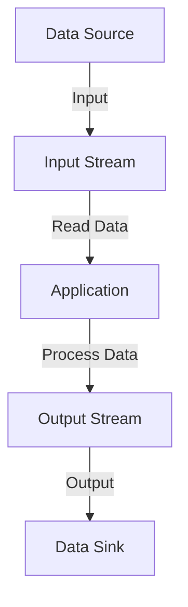
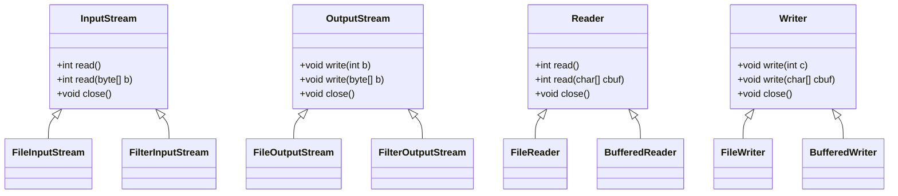
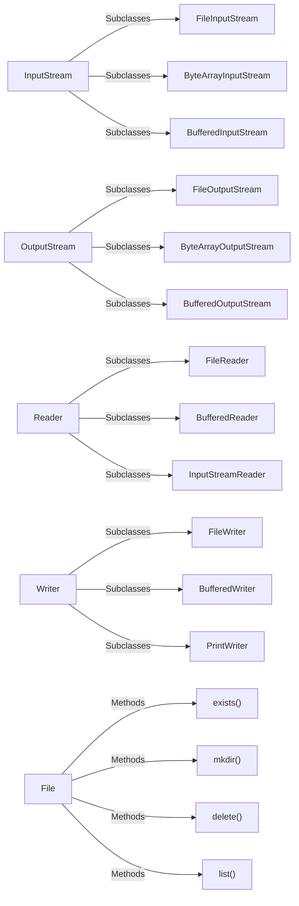

# 🌟**Java I/O and File Handling** 🌟

## **Module 1: Introduction to Java I/O**
### 🔍 **Understanding Java I/O Fundamentals**
- **What is I/O in Java?**
- **Overview of Input/Output Streams**
  - Input and Output mechanisms in Java.
- **Byte Streams vs Character Streams**
- **The `java.io` Package**

### 📝 **Streams in Java**
- **What is a Stream?**
  - Unidirectional flow of data.
- **Class Hierarchy of Java I/O Streams**:
  - InputStream
  - OutputStream
  - Reader
  - Writer

### **📂 Java I/O Classes Overview**
- **Key Classes:**
  - `InputStream`, `OutputStream`
  - `Reader`, `Writer`
  - `File` class (managing files and directories)

> **Objective:**  
> Why is I/O handling crucial in programming? When to use Byte or Character streams?

---

## **Module 2: Byte Streams in Java**
### 🚀 **Introduction to Byte Streams**
- **What are Byte Streams?**
- **Classes:**
  - `InputStream` and `OutputStream`
  
### 📥 **Reading from a File Using Byte Streams**
- **Key Classes:**
  - `FileInputStream`
- **Methods:**
  - `read()`, `read(byte[] b)`
  
### 📤 Writing to a File Using Byte Streams

- **Key Classes:**
  - `FileOutputStream`
- **Methods:**
  - `write(int b)`, `write(byte[] b)`

### 📊 Advanced Byte Stream Usage
- Working with images and audio files.
- Handling large binary files efficiently.
### 🔨 Exercises:
- Write a program to copy a binary file using byte streams.
- Create a program that reads a list of integers from a file and writes the sum to another file.
---
## **Module 3: Character Streams in Java**
### 🚀 Introduction to Character Streams
- Differences between Byte and Character Streams
- Classes:
  - `Reader` and `Writer`

### 📥 Reading from Files Using Character Streams

- Differences between Byte and Character Streams

- Key Classes:
  - `FileReader`

- Methods:
  - `read()`,`read(char[] cbuf)`

### 📤 Writing to Files Using Character Streams

- Key Classes:
  - `FileWriter`
  
- Methods:
  - `write(int c)`,`write(char[] cbuf)`,`write(String str)`

### 🌍 Handling Multilingual Texts

- Using InputStreamReader and OutputStreamWriter to deal with character encoding.

### 🔨 Exercises:

- Create a program to read and write data in a text file using FileReader and FileWriter

- Implement a program to handle multiple file types (CSV, TXT) using character streams.

---
## Module 4: Buffered Streams for Efficient I/O

### 🚀 Introduction to Buffered Streams

- Buffered I/O Overview
- Why use Buffered Streams?

### 📥 Reading with `BufferedReader`

- `Key Class:`

   - `BufferedReader`

- `Methods:`
   
   - `readLine()`,`read(char[] cbuf, int off, int len)`,  

### 📤 Writing with BufferedWriter

- `Key Class:`

   - `BufferedWriter`

- `Methods:`
   
   - `write()`,`newLine()`, `flush()`

### 🔨 Exercises:

- Create a program to read a large text file using BufferedReader and count the lines.
- Write a program to buffer data of a large text file and write it to another file using  
  BufferedWriter.

---
## Module 5: File Handling in Java

### 🚀 Working with the File Class

- Managing Files and Directories
    - Creating, deleting, renaming files.
    - Methods: `exists()`, `canRead()`, `canWrite()`, `isFile()`, `isDirectory()`, `mkdir()`, `delete()`

### 📂 Directory Handling

- Listing files in a directory using `list()` and `listFiles()`.
- Creating and managing directories using `mkdir()` and `mkdirs()`.

### 🔨 Exercises:

- Write a program to create a new directory and list all files inside it.
- Implement a **file explorer** that shows file properties (size, type, date).

---
## Module 6: Serialization in Java

### 🚀 Introduction to Serialization

- What is Serialization?
- Classes :
  - `ObjectInputStream`, `ObjectOutputStream`

### 📂 Serialization and Deserialization of Objects

- Saving objects to files using `Serializable`.

- **Restoring objects** from files.

### 🔍 Transient Keyword

- Skipping sensitive data during serialization using transient.

### 🔨 Exercises:

- Serialize a list of student objects and deserialize them back.

- Create an Employee database system using serialization.

---
## Module 7: Real-World Applications of Java I/O

### 📊 Case Study 1: Log File Management System

 -  Efficient log management for a large-scale application.

### 💾 Case Study 2: Data Backup and Restoration

 -  Using serialization for data backup and recovery.

### 📑 Case Study 3: Configuration File Parsing

 -  Parsing configuration settings from properties or XML files.

---

## Module 8: Best Practices for Java I/O

### 💡 Optimizing I/O Operations
 
 - When to use buffering, memory management, and closing resources.

### ⚠️ Exception Handling in I/O

 - Handling FileNotFoundException, IOException, and using try-with-resources.

## Module 9: Advanced I/O Techniques

### 🚀 NIO (New I/O) Package

- Difference between I/O and NIO.

- Classes: `FileChannel`, `Buffer`, `Paths`, `Files`.

### 📊 Memory-Mapped Files

- Using `MappedByteBuffer` for large files and performance improvement.


---

NOTES HERE
---

# Understanding Java I/O Fundamentals

## Introduction
Java I/O (Input/Output) is a crucial part of programming in Java, allowing developers to read from and write to data sources such as files, console, and network connections. This document provides a comprehensive overview of Java I/O fundamentals, covering key concepts, mechanisms, and the essential classes involved.

---

## 1. What is I/O in Java?
- **I/O Operations**: These refer to the methods used to receive data from input sources and send data to output destinations.
- **Purpose**: I/O operations are vital for data processing, allowing applications to interact with users and other systems.
  
---

## 2. Overview of Input/Output Streams
- **Streams**: A stream is a sequence of data elements made available over time.
- **Input Stream**: A stream that delivers data to a program (e.g., reading data from a file).
- **Output Stream**: A stream that sends data from a program (e.g., writing data to a file).

### Stream Types
- **Byte Streams**: Handle raw binary data, allowing for more efficient handling of binary files (e.g., images, audio).
- **Character Streams**: Handle character data, supporting text processing and enabling the use of various character encodings.

---

## 3. Input and Output Mechanisms in Java
- Java provides mechanisms for:
  - **Reading data** from files, keyboard input, or network sockets.
  - **Writing data** to files, displaying output to the console, or sending data over the network.

### Input/Output Flow

## 4. Byte Streams vs Character Streams

| Aspect                | Byte Streams                   | Character Streams                |
|-----------------------|-------------------------------|----------------------------------|
| Data Type             | Raw binary data               | Character data                   |
| Class Hierarchy       | InputStream, OutputStream     | Reader, Writer                   |
| Encoding              | No encoding support           | Supports character encoding       |
| Use Cases             | Images, audio files           | Text files                       |

## 5. The java.io Package

- The java.io package provides classes for system input and output through data streams, serialization, and the file system.

- Key Classes:
  
  - `File:` Represents files and directory pathnames.
  - `FileInputStream:` Reads bytes from a file.
  - `FileOutputStream:` Writes bytes to a file.
  - `BufferedReader:` Reads text from a character input stream, buffering characters for efficient reading.
  - `BufferedWriter:` Writes text to a character output stream, buffering characters for efficient writing.

- Important Interfaces

  `Serializable:` Marks a class whose objects can be serialized (converted into a byte stream)

# Streams in Java

## What is a Stream?
A **stream** in Java represents a unidirectional flow of data. It is an abstraction that allows us to read and write data in a continuous manner. Streams can be categorized into two types based on how they handle data:

- **Byte Streams**: Handle binary data.
- **Character Streams**: Handle text data.

## Key Features of Streams
- **Unidirectional Flow**: Data flows in one direction, either input or output.
- **Efficiency**: Streams allow efficient reading and writing of data.
- **Abstraction**: They provide a simplified interface for I/O operations.

## Class Hierarchy of Java I/O Streams

The Java I/O streams are part of the `java.io` package and are organized in a class hierarchy. The primary classes include:

1. **InputStream**: An abstract class that represents an input stream of bytes. It provides methods for reading data from a source.
2. **OutputStream**: An abstract class that represents an output stream of bytes. It provides methods for writing data to a destination.
3. **Reader**: An abstract class for reading character streams. It handles text data, providing methods to read characters.
4. **Writer**: An abstract class for writing character streams. It handles text data, providing methods to write characters.

### Class Hierarchy Diagram


# Java I/O Classes Overview

## Introduction
Java I/O (Input/Output) is a part of the Java programming language that allows developers to read and write data to various sources, including files, memory, and network connections. Understanding the key classes in Java I/O is crucial for efficient data handling in your applications.

## Key Classes

### 1. InputStream
- **Description**: Abstract class representing an input stream of bytes.
- **Key Methods**:
  - `int read()`: Reads the next byte of data.
  - `int read(byte[] b)`: Reads up to `b.length` bytes of data into an array.
  - `int available()`: Returns the number of bytes that can be read without blocking.
- **Common Subclasses**:
  - `FileInputStream`: Reads bytes from a file.
  - `ByteArrayInputStream`: Reads bytes from a byte array.
  - `BufferedInputStream`: Buffers input for performance improvement.

### 2. OutputStream
- **Description**: Abstract class representing an output stream of bytes.
- **Key Methods**:
  - `void write(int b)`: Writes the specified byte to the output stream.
  - `void write(byte[] b)`: Writes `b.length` bytes from the specified byte array.
  - `void flush()`: Flushes the output stream and forces any buffered output bytes to be written out.
- **Common Subclasses**:
  - `FileOutputStream`: Writes bytes to a file.
  - `ByteArrayOutputStream`: Writes bytes to a byte array.
  - `BufferedOutputStream`: Buffers output for performance improvement.

### 3. Reader
- **Description**: Abstract class for reading character streams.
- **Key Methods**:
  - `int read()`: Reads a single character.
  - `int read(char[] cbuf)`: Reads characters into a buffer.
  - `void close()`: Closes the stream and releases any resources associated with it.
- **Common Subclasses**:
  - `FileReader`: Reads characters from a file.
  - `BufferedReader`: Buffers characters for performance improvement, also provides `readLine()` method.
  - `InputStreamReader`: Bridges byte streams to character streams.

### 4. Writer
- **Description**: Abstract class for writing character streams.
- **Key Methods**:
  - `void write(int c)`: Writes a single character.
  - `void write(char[] cbuf)`: Writes a character array.
  - `void flush()`: Flushes the stream.
- **Common Subclasses**:
  - `FileWriter`: Writes characters to a file.
  - `BufferedWriter`: Buffers characters for performance improvement, also provides `newLine()` method.
  - `PrintWriter`: Allows formatted output and automatic flushing.

### 5. File Class
- **Description**: Represents a file or directory path in the file system.
- **Key Methods**:
  - `boolean exists()`: Tests if the file or directory exists.
  - `boolean mkdir()`: Creates a directory.
  - `boolean delete()`: Deletes the file or directory.
  - `String[] list()`: Lists files in a directory.
- **Usage**: The `File` class is essential for managing files and directories, providing methods for creating, deleting, and querying file properties.





### Why is I/O Handling Crucial in Programming?

- **Data Interaction**: I/O operations facilitate the interaction between the program and external data sources, enabling the program to receive input and provide output.
- **User Experience**: Proper handling of I/O can enhance user experience by allowing programs to accept user input and display results efficiently.
- **Data Persistence**: I/O handling allows data to be stored in files or databases, ensuring that information can be retrieved and reused in future sessions.
- **Networking**: I/O operations are essential for sending and receiving data over networks, making it vital for web applications and services.
- **Performance**: Efficient I/O operations can significantly improve the performance of applications, especially when handling large amounts of data.


```mermaid
flowchart TD
    A[Input/Output Handling] -->|Involves| B[Data Interaction]
    A -->|Enhances| C[User Experience]
    A -->|Enables| D[Data Persistence]
    A -->|Facilitates| E[Networking]
    A -->|Improves| F[Performance]

    B --> G[Character Streams]
    B --> H[Byte Streams]

    G --> I{When to Use}
    I --> J[Text Files]
    I --> K[Character Encoding]

    H --> L{When to Use}
    L --> M[Binary Files]
    L --> N[Non-Text Formats]

