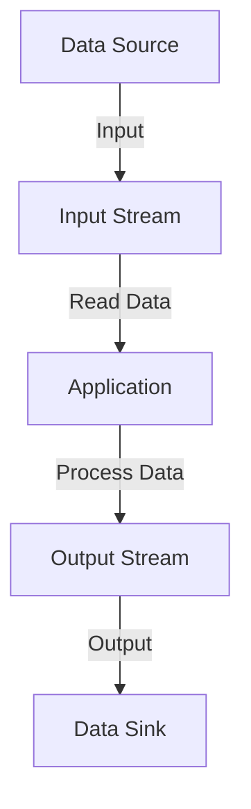
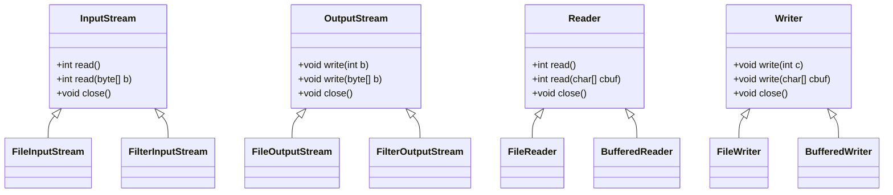
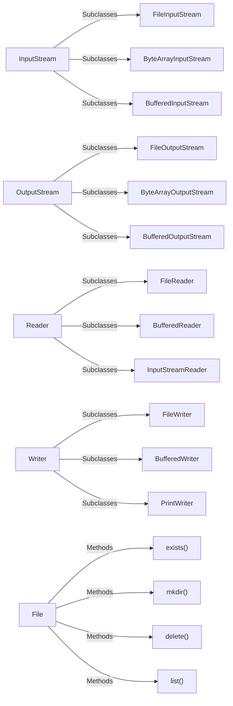
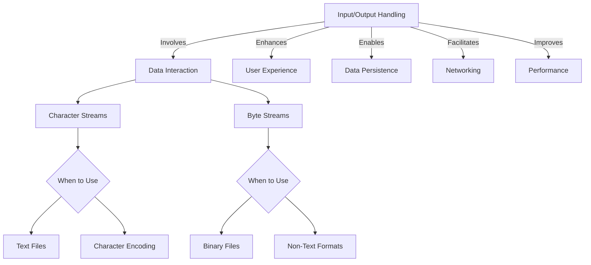
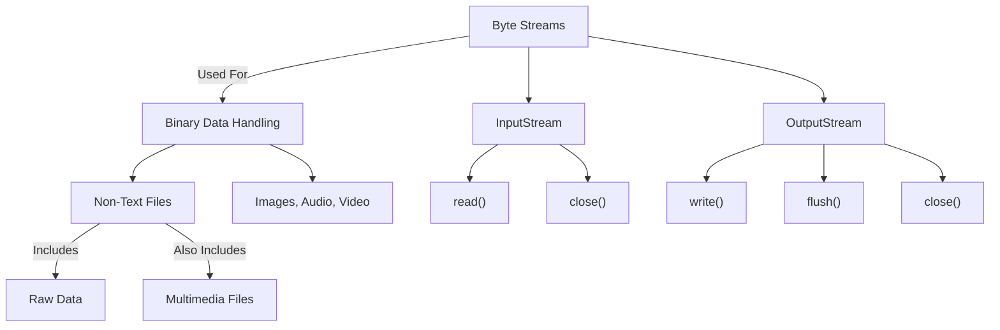
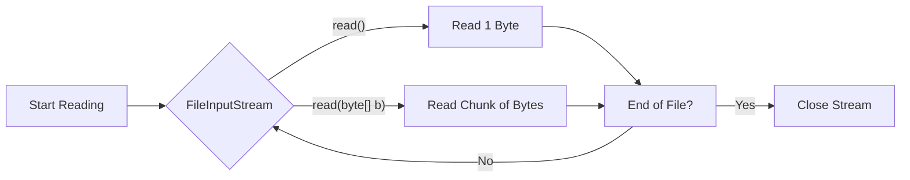
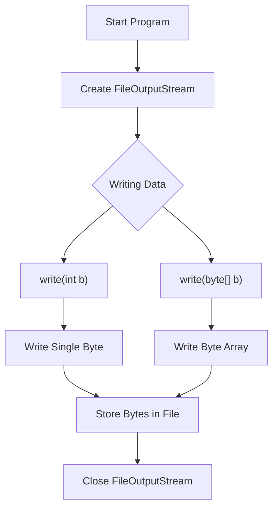
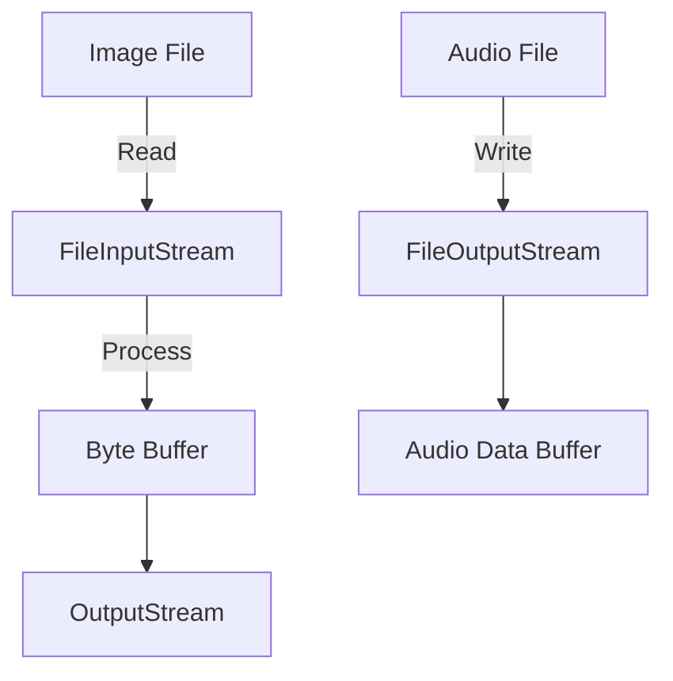
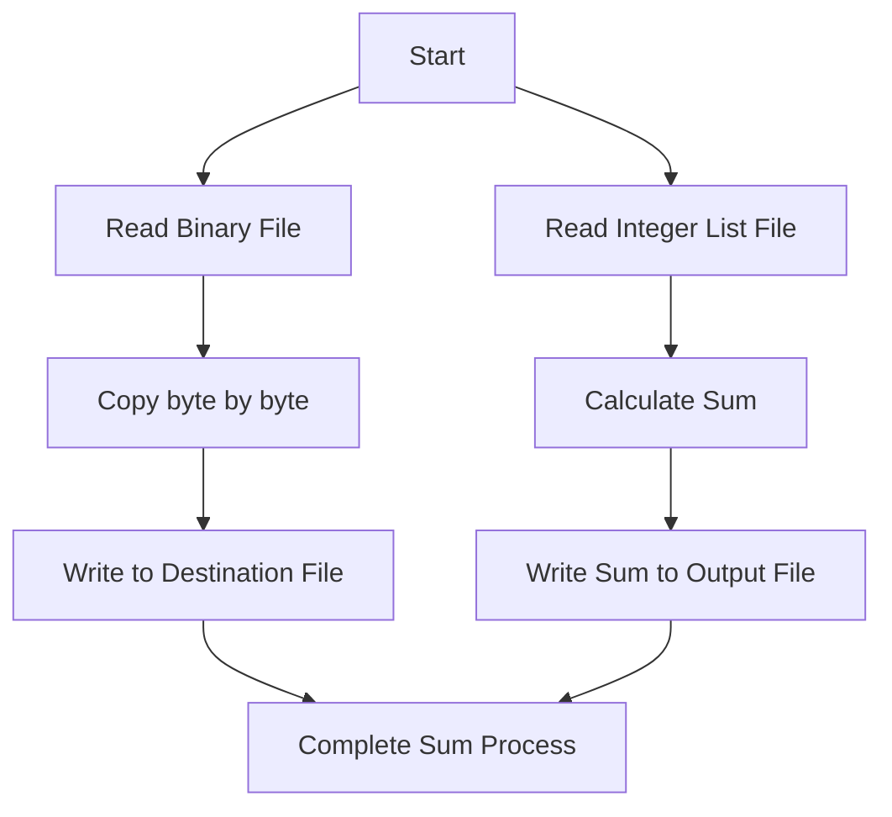

# 🌟**Java I/O and File Handling** 🌟

## **Module 1: Introduction to Java I/O**
### 🔍 **Understanding Java I/O Fundamentals**
- **What is I/O in Java?**
- **Overview of Input/Output Streams**
  - Input and Output mechanisms in Java.
- **Byte Streams vs Character Streams**
- **The `java.io` Package**

### 📝 **Streams in Java**
- **What is a Stream?**
  - Unidirectional flow of data.
- **Class Hierarchy of Java I/O Streams**:
  - InputStream
  - OutputStream
  - Reader
  - Writer

### **📂 Java I/O Classes Overview**
- **Key Classes:**
  - `InputStream`, `OutputStream`
  - `Reader`, `Writer`
  - `File` class (managing files and directories)

> **Objective:**  
> Why is I/O handling crucial in programming? When to use Byte or Character streams?

---

## **Module 2: Byte Streams in Java**
### 🚀 **Introduction to Byte Streams**
- **What are Byte Streams?**
- **Classes:**
  - `InputStream` and `OutputStream`
  
### 📥 **Reading from a File Using Byte Streams**
- **Key Classes:**
  - `FileInputStream`
- **Methods:**
  - `read()`, `read(byte[] b)`
  
### 📤 Writing to a File Using Byte Streams

- **Key Classes:**
  - `FileOutputStream`
- **Methods:**
  - `write(int b)`, `write(byte[] b)`

### 📊 Advanced Byte Stream Usage
- Working with images and audio files.
- Handling large binary files efficiently.
### 🔨 Exercises:
- Write a program to copy a binary file using byte streams.
- Create a program that reads a list of integers from a file and writes the sum to another file.
---
## **Module 3: Character Streams in Java**
### 🚀 Introduction to Character Streams
- Differences between Byte and Character Streams
- Classes:
  - `Reader` and `Writer`

### 📥 Reading from Files Using Character Streams

- Differences between Byte and Character Streams

- Key Classes:
  - `FileReader`

- Methods:
  - `read()`,`read(char[] cbuf)`

### 📤 Writing to Files Using Character Streams

- Key Classes:
  - `FileWriter`
  
- Methods:
  - `write(int c)`,`write(char[] cbuf)`,`write(String str)`

### 🌍 Handling Multilingual Texts

- Using InputStreamReader and OutputStreamWriter to deal with character encoding.

### 🔨 Exercises:

- Create a program to read and write data in a text file using FileReader and FileWriter

- Implement a program to handle multiple file types (CSV, TXT) using character streams.

---
## Module 4: Buffered Streams for Efficient I/O

### 🚀 Introduction to Buffered Streams

- Buffered I/O Overview
- Why use Buffered Streams?

### 📥 Reading with `BufferedReader`

- `Key Class:`

   - `BufferedReader`

- `Methods:`
   
   - `readLine()`,`read(char[] cbuf, int off, int len)`,  

### 📤 Writing with BufferedWriter

- `Key Class:`

   - `BufferedWriter`

- `Methods:`
   
   - `write()`,`newLine()`, `flush()`

### 🔨 Exercises:

- Create a program to read a large text file using BufferedReader and count the lines.
- Write a program to buffer data of a large text file and write it to another file using  
  BufferedWriter.

---
## Module 5: File Handling in Java

### 🚀 Working with the File Class

- Managing Files and Directories
    - Creating, deleting, renaming files.
    - Methods: `exists()`, `canRead()`, `canWrite()`, `isFile()`, `isDirectory()`, `mkdir()`, `delete()`

### 📂 Directory Handling

- Listing files in a directory using `list()` and `listFiles()`.
- Creating and managing directories using `mkdir()` and `mkdirs()`.

### 🔨 Exercises:

- Write a program to create a new directory and list all files inside it.
- Implement a **file explorer** that shows file properties (size, type, date).

---
## Module 6: Serialization in Java

### 🚀 Introduction to Serialization

- What is Serialization?
- Classes :
  - `ObjectInputStream`, `ObjectOutputStream`

### 📂 Serialization and Deserialization of Objects

- Saving objects to files using `Serializable`.

- **Restoring objects** from files.

### 🔍 Transient Keyword

- Skipping sensitive data during serialization using transient.

### 🔨 Exercises:

- Serialize a list of student objects and deserialize them back.

- Create an Employee database system using serialization.

---
## Module 7: Real-World Applications of Java I/O

### 📊 Case Study 1: Log File Management System

 -  Efficient log management for a large-scale application.

### 💾 Case Study 2: Data Backup and Restoration

 -  Using serialization for data backup and recovery.

### 📑 Case Study 3: Configuration File Parsing

 -  Parsing configuration settings from properties or XML files.

---

## Module 8: Best Practices for Java I/O

### 💡 Optimizing I/O Operations
 
 - When to use buffering, memory management, and closing resources.

### ⚠️ Exception Handling in I/O

 - Handling FileNotFoundException, IOException, and using try-with-resources.

## Module 9: Advanced I/O Techniques

### 🚀 NIO (New I/O) Package

- Difference between I/O and NIO.

- Classes: `FileChannel`, `Buffer`, `Paths`, `Files`.

### 📊 Memory-Mapped Files

- Using `MappedByteBuffer` for large files and performance improvement.


---
# MODULE-I
---

# Understanding Java I/O Fundamentals

## Introduction
Java I/O (Input/Output) is a crucial part of programming in Java, allowing developers to read from and write to data sources such as files, console, and network connections. This document provides a comprehensive overview of Java I/O fundamentals, covering key concepts, mechanisms, and the essential classes involved.

---

## 1. What is I/O in Java?
- **I/O Operations**: These refer to the methods used to receive data from input sources and send data to output destinations.
- **Purpose**: I/O operations are vital for data processing, allowing applications to interact with users and other systems.
  
---

## 2. Overview of Input/Output Streams
- **Streams**: A stream is a sequence of data elements made available over time.
- **Input Stream**: A stream that delivers data to a program (e.g., reading data from a file).
- **Output Stream**: A stream that sends data from a program (e.g., writing data to a file).

### Stream Types
- **Byte Streams**: Handle raw binary data, allowing for more efficient handling of binary files (e.g., images, audio).
- **Character Streams**: Handle character data, supporting text processing and enabling the use of various character encodings.

---

## 3. Input and Output Mechanisms in Java
- Java provides mechanisms for:
  - **Reading data** from files, keyboard input, or network sockets.
  - **Writing data** to files, displaying output to the console, or sending data over the network.

### Input/Output Flow

## 4. Byte Streams vs Character Streams

| Aspect                | Byte Streams                   | Character Streams                |
|-----------------------|-------------------------------|----------------------------------|
| Data Type             | Raw binary data               | Character data                   |
| Class Hierarchy       | InputStream, OutputStream     | Reader, Writer                   |
| Encoding              | No encoding support           | Supports character encoding       |
| Use Cases             | Images, audio files           | Text files                       |

## 5. The java.io Package

- The java.io package provides classes for system input and output through data streams, serialization, and the file system.

- Key Classes:
  
  - `File:` Represents files and directory pathnames.
  - `FileInputStream:` Reads bytes from a file.
  - `FileOutputStream:` Writes bytes to a file.
  - `BufferedReader:` Reads text from a character input stream, buffering characters for efficient reading.
  - `BufferedWriter:` Writes text to a character output stream, buffering characters for efficient writing.

- Important Interfaces

  `Serializable:` Marks a class whose objects can be serialized (converted into a byte stream)

# Streams in Java

## What is a Stream?
A **stream** in Java represents a unidirectional flow of data. It is an abstraction that allows us to read and write data in a continuous manner. Streams can be categorized into two types based on how they handle data:

- **Byte Streams**: Handle binary data.
- **Character Streams**: Handle text data.

## Key Features of Streams
- **Unidirectional Flow**: Data flows in one direction, either input or output.
- **Efficiency**: Streams allow efficient reading and writing of data.
- **Abstraction**: They provide a simplified interface for I/O operations.

## Class Hierarchy of Java I/O Streams

The Java I/O streams are part of the `java.io` package and are organized in a class hierarchy. The primary classes include:

1. **InputStream**: An abstract class that represents an input stream of bytes. It provides methods for reading data from a source.
2. **OutputStream**: An abstract class that represents an output stream of bytes. It provides methods for writing data to a destination.
3. **Reader**: An abstract class for reading character streams. It handles text data, providing methods to read characters.
4. **Writer**: An abstract class for writing character streams. It handles text data, providing methods to write characters.

### Class Hierarchy Diagram


# Java I/O Classes Overview

## Introduction
Java I/O (Input/Output) is a part of the Java programming language that allows developers to read and write data to various sources, including files, memory, and network connections. Understanding the key classes in Java I/O is crucial for efficient data handling in your applications.

## Key Classes

### 1. InputStream
- **Description**: Abstract class representing an input stream of bytes.
- **Key Methods**:
  - `int read()`: Reads the next byte of data.
  - `int read(byte[] b)`: Reads up to `b.length` bytes of data into an array.
  - `int available()`: Returns the number of bytes that can be read without blocking.
- **Common Subclasses**:
  - `FileInputStream`: Reads bytes from a file.
  - `ByteArrayInputStream`: Reads bytes from a byte array.
  - `BufferedInputStream`: Buffers input for performance improvement.

### 2. OutputStream
- **Description**: Abstract class representing an output stream of bytes.
- **Key Methods**:
  - `void write(int b)`: Writes the specified byte to the output stream.
  - `void write(byte[] b)`: Writes `b.length` bytes from the specified byte array.
  - `void flush()`: Flushes the output stream and forces any buffered output bytes to be written out.
- **Common Subclasses**:
  - `FileOutputStream`: Writes bytes to a file.
  - `ByteArrayOutputStream`: Writes bytes to a byte array.
  - `BufferedOutputStream`: Buffers output for performance improvement.

### 3. Reader
- **Description**: Abstract class for reading character streams.
- **Key Methods**:
  - `int read()`: Reads a single character.
  - `int read(char[] cbuf)`: Reads characters into a buffer.
  - `void close()`: Closes the stream and releases any resources associated with it.
- **Common Subclasses**:
  - `FileReader`: Reads characters from a file.
  - `BufferedReader`: Buffers characters for performance improvement, also provides `readLine()` method.
  - `InputStreamReader`: Bridges byte streams to character streams.

### 4. Writer
- **Description**: Abstract class for writing character streams.
- **Key Methods**:
  - `void write(int c)`: Writes a single character.
  - `void write(char[] cbuf)`: Writes a character array.
  - `void flush()`: Flushes the stream.
- **Common Subclasses**:
  - `FileWriter`: Writes characters to a file.
  - `BufferedWriter`: Buffers characters for performance improvement, also provides `newLine()` method.
  - `PrintWriter`: Allows formatted output and automatic flushing.

### 5. File Class
- **Description**: Represents a file or directory path in the file system.
- **Key Methods**:
  - `boolean exists()`: Tests if the file or directory exists.
  - `boolean mkdir()`: Creates a directory.
  - `boolean delete()`: Deletes the file or directory.
  - `String[] list()`: Lists files in a directory.
- **Usage**: The `File` class is essential for managing files and directories, providing methods for creating, deleting, and querying file properties.





### Why is I/O Handling Crucial in Programming?

- **Data Interaction**: I/O operations facilitate the interaction between the program and external data sources, enabling the program to receive input and provide output.
- **User Experience**: Proper handling of I/O can enhance user experience by allowing programs to accept user input and display results efficiently.
- **Data Persistence**: I/O handling allows data to be stored in files or databases, ensuring that information can be retrieved and reused in future sessions.
- **Networking**: I/O operations are essential for sending and receiving data over networks, making it vital for web applications and services.
- **Performance**: Efficient I/O operations can significantly improve the performance of applications, especially when handling large amounts of data.



--- 

# MODULE-II

## Byte Streams in Java 🌟

### 📖 Introduction to Byte Streams

#### What are Byte Streams? ⚙️

Byte streams in Java are used for handling input and output of 8-bit bytes. They are primarily designed to read and write raw binary data such as images, audio, video, or any other form of non-character data.

- **Definition**: Byte streams deal with reading and writing binary data, which is typically raw and unprocessed.
- **Uses**: Perfect when working with file formats like images, audio files, video files, and other multimedia data.
- **Binary Data**: Byte streams work at the lowest level, transmitting raw binary data directly between a program and a file, network socket, or any other I/O source.

#### Classes in Byte Streams 🎯

Java provides two main classes to handle byte streams:
1. **InputStream** (for reading data) 📥
2. **OutputStream** (for writing data) 📤

These classes are the foundation of all byte stream operations in Java.

### 🔍 InputStream Class

#### What is InputStream? 🧐

The `InputStream` class is an abstract class that provides a means for reading byte data from various input sources, such as files, network sockets, and byte arrays.

- **Key Methods**:
  - `read()`: Reads the next byte of data from the input stream.
  - `close()`: Closes the input stream and releases any system resources associated with it.

#### Example of `InputStream`:

```java
FileInputStream input = new FileInputStream("input.txt");
int data = input.read();
while(data != -1) {
    System.out.print((char) data);
    data = input.read();
}
input.close();
```

### 📤 OutputStream Class

#### What is OutputStream? 🖨️

The `OutputStream` class is an abstract class used to write byte data to an output destination, such as files, network connections, or byte arrays.

- **Key Methods**:
  - `write(int b):` Writes the specified byte to the output stream.
  - `flush():` Forces any buffered output bytes to be written out.
  - `close():` Closes the output stream and releases any system resources associated with it.

#### Example of `OutputStream`:

```java
FileOutputStream output = new FileOutputStream("output.txt");
output.write(65);  // Writes the ASCII value of 'A'
output.close();
```

## 🏁 Summary

- `Byte Streams` are used to handle raw binary data.
- The two main classes are:
  - `InputStream:` Reads byte data from an input source.
  - `OutputStream:` Writes byte data to an output destination.

## 🧠 Exercise: Byte Stream Practice

### 1. Create a Program to Read a Binary File:
Write a Java program that uses InputStream to read a binary file byte by byte and prints the data in its binary form.

### 2. Create a Program to Write Binary Data:
Write a Java program that uses OutputStream to write binary data (e.g., ASCII values of a string) to a file.

## ❓ Objective Questions

**1. Which class is used for reading byte data in Java?**
  - a) Reader
  - b) InputStream
  - c) OutputStream
  - d) Writer
  
**2. What method is used to write a byte in OutputStream?**
  - a) writeByte()
  - b) write(int b)
  - c) sendData()
  - d) outputByte()

**3. Which method in InputStream reads the next byte of data?**
  - a) readByte()
  - b) read(int)
  - c) read()
  - d) fetch()


## 📂 Reading from a File Using Byte Streams 🌟

In Java, byte streams are used to read raw binary data from files. Byte streams work with data in its most primitive form—**bytes**. When you need to read from a binary file (e.g., images, audio, etc.), byte streams are your best tool.

### 🗝️ Key Classes: `FileInputStream`

The **`FileInputStream`** class in Java is one of the core classes used to read data from a file using byte streams. It reads the file byte by byte, making it perfect for binary data.

### ✨ Key Features of `FileInputStream`:

- **Purpose**: Reads raw byte data from files.

- **Usage**: Used for non-character data like images, videos, etc.

- **Extends**: `InputStream`, making it a specialized input stream for file handling.

---

### 🚀 Methods in `FileInputStream`

#### 1. `read()` Method 📖

- **Description**: Reads one byte of data from the input stream.

- **Returns**: The next byte of data or `-1` if the end of the stream is reached.

#### Example:
```java
FileInputStream fis = new FileInputStream("inputfile.txt");
int byteData = fis.read();
while(byteData != -1) {
    System.out.print((char) byteData);  // Prints the byte as a character
    byteData = fis.read();
}
fis.close();
```
In the example above, the file inputfile.txt is read one byte at a time and then printed as a character.

#### 2. read(byte[] b) Method 📦

- **Description**: Reads up to `b.length` bytes of data into the byte array `b`.

- **Returns**: The next byte of data or `-1` if the end of the stream is reached.

#### Example:
```java
FileInputStream fis = new FileInputStream("inputfile.txt");
byte[] buffer = new byte[10];  // Create a buffer with a size of 10 bytes
int bytesRead = fis.read(buffer);
while(bytesRead != -1) {
    for (int i = 0; i < bytesRead; i++) {
        System.out.print((char) buffer[i]);  // Prints each byte as a character
    }
    bytesRead = fis.read(buffer);
}
fis.close();
```
In this case, read(byte[] b) method reads up to 10 bytes at a time into the buffer, making the reading process more efficient than reading one byte at a time.



## 🛠️ Explanation:

1. **Start Reading:** Initializes the `FileInputStream` object to read the file.

2. **read():** Reads one byte of data at a time.

3. **read(byte[] b):** Reads multiple bytes in chunks into the byte array b.

4. **End of File?:** Checks if the file has reached its end.

5. **Close Stream:** Closes the stream once all bytes are read.

## 🧠 Key Points to Remember:

- **Single Byte vs Byte Array:** You can read data either byte by byte (`read()`) or in chunks using a byte array (`read(byte[] b)`).

- **Efficiency:** Reading in chunks is more efficient, especially for larger files.

- **Closing Streams:** Always ensure that the input stream is closed after the operation to free system resources.

## 🌟 Real-Life Case Study: Reading Image Files 🖼️

**Scenario:** Let's say you're developing an application that processes images. When you need to read an image file, using byte streams allows you to access and manipulate the raw binary data without converting it into characters.

**Code Example:**

```java
FileInputStream imageStream = new FileInputStream("image.jpg");
byte[] imageBytes = new byte[1024];  // Buffer to store image data
int bytesRead = imageStream.read(imageBytes);
while (bytesRead != -1) {
    // Process the image bytes, for example, saving them to another file
    bytesRead = imageStream.read(imageBytes);
}
imageStream.close();
```
This approach allows the application to handle non-text files efficiently and ensures that large files are read in manageable chunks.

## ✍️ Exercise: Practice File Reading 📝

1. **Create a Java Program** that reads a text file one byte at a time using `FileInputStream` and prints the content on the console.

2. **Create a Java Program** that reads a file in chunks of bytes using read(`byte[] b`) and processes each chunk (e.g., prints it or stores it).

## ❓ Objective Questions: Test Your Knowledge

1. What does the read() method in FileInputStream return when the end of a file is reached?

    - a. 0
    - b. -1
    - c. EOFException
    - d. 1

2. What is the advantage of using read(byte[] b) over read() in Java byte streams?

    - a. It reads characters instead of bytes.
    - b. It closes the stream automatically.
    - c. It reads data in chunks, making it faster for large files.
    - d. It converts bytes to text automatically.

3. Which of the following classes is a subclass of InputStream in Java?

    - a. Reader
    - b. FileInputStream
    - c. BufferedReader
    - d. DataOutputStream

# 🌟 Writing to a File Using Byte Streams in Java 🌟

## 🎯 Key Objective

**Why is file writing important?**  
Writing to files allows you to save data permanently, be it a simple text log or binary data like images and audio. This concept is crucial for developers working on applications that need persistent storage.

---

## 📝 Key Classes

When writing to a file using byte streams in Java, we primarily use the `FileOutputStream` class.

### 💻 FileOutputStream

The `FileOutputStream` class in Java is used to write raw bytes to a file, such as image data, text data in binary form, or any other stream of data.

**Key Characteristics**:
- **FileOutputStream** is used to create a file and write data into it.
- You can write a single byte, or an array of bytes, into the file.
- It overwrites the file's content unless specified otherwise.

---

## 🛠️ Methods

### 1. **write(int b)**
- This method writes a **single byte** to the file output stream.
- It writes the **least significant 8 bits** of the `int` argument to the output stream.

```java
FileOutputStream output = new FileOutputStream("output.txt");
output.write(65);  // Writes the ASCII value for 'A' into the file
output.close();
```
`💡 Note:` ASCII value 65 corresponds to the character A.

### 2. **write(byte[] b)**
- This method writes an array of bytes to the output stream.
- It takes a byte array and writes all of its elements to the file.

```java
FileOutputStream output = new FileOutputStream("output.txt");
byte[] data = "Hello World".getBytes();  // Converts String to bytes
output.write(data);  // Writes the entire "Hello World" to the file
output.close();
```
`💡 Note:` The `getBytes()` method converts a `String` into a byte array for writing to the file.



### 💡 Step-by-Step Example

Let’s combine everything we’ve learned and create a practical example:

#### Scenario: Writing to a File

You want to save a log message to a file called `log.txt`.

```java
import java.io.FileOutputStream;
import java.io.IOException;

public class FileWriteExample {
    public static void main(String[] args) {
        try {
            // Create a FileOutputStream object
            FileOutputStream output = new FileOutputStream("log.txt");
            
            // Data to be written
            String logMessage = "User login successful on 2024-10-09";
            
            // Convert the String to bytes
            byte[] logBytes = logMessage.getBytes();
            
            // Write the byte array to the file
            output.write(logBytes);
            
            // Close the stream
            output.close();
            
            System.out.println("Log written to file successfully.");
        } catch (IOException e) {
            e.printStackTrace();
        }
    }
}
```
### 🛠️ Steps in the Code:

1. `Create a FileOutputStream` – This opens a connection to the file where the data will be written.

2. `Convert data to byte array` – Use `getBytes()` to convert the `String` data to bytes.

3. `Write the byte array to the file` – Using the `write(byte[] b)` method, we save the entire log message.

4. `Close the stream` – Always close the stream to release system resources and avoid memory leaks.

### 🧠 Real-World Case Study: Writing User Data Logs

**Scenario:**

A web application logs every user login with a timestamp. Every time a user logs in, the system saves the login event as a byte stream in a log.txt file. This data helps in tracking the user activity for security purposes.

**How does FileOutputStream help here?**

- The `FileOutputStream` is used to write these log entries as byte arrays, which can be saved as logs in a file. Each login attempt is appended to the existing log file, ensuring that the system has a permanent record of user actions.

### 🧠 Practice Exercises

**1. Write a Simple Text to a File**

  - Create a program that writes `"Java I/O is fun!"` to a file called `iofun.txt` using `FileOutputStream`.

**2. Write User Details to a File**

  - Prompt the user for their name and age, and write this information to a file called   `userdetails.txt` in byte format.

**3. Write a Byte Array to a File**

  - Write a program that writes an array of numbers (byte values) to a file and then reads them back to display on the console.

### 🧠 Objective Questions

1. What class is used to write byte data to a file in Java? a) FileReader
    - b) FileWriter
    - c) FileOutputStream
    - d) DataOutputStream

2. Which method writes a single byte to the file in FileOutputStream? a) writeByte()
    - b) write(int b)
    - c) writeByteArray()
    - d) writeData()

3. How do you convert a String to byte array in Java? a) String.getData()
    - b) String.toBytes()
    - c) String.getBytes()
    - d) String.byteArray()

### 🎉 Conclusion

- Writing to files using byte streams is an essential part of Java I/O.

- **FileOutputStream** allows you to write raw binary data to a file, making it useful for both text and non-text data.

- Mastering byte stream methods, such as `write(int b)` and `write(byte[] b)`, helps in handling raw data efficiently.


# 🌟 Advanced Byte Stream Usage 🌟

Byte streams are not only useful for basic I/O operations but also crucial when working with **multimedia files** such as images and audio, as well as efficiently managing large binary files.

---

## 🎯 Objectives:

- Learn how to handle **images** and **audio files** using byte streams.
- Understand techniques to work with **large binary files** effectively.
- Explore Java classes that help in managing these tasks efficiently.

---

## 🖼️ Working with Images and Audio Files 🎶

When dealing with multimedia files such as images and audio, byte streams are used to read and write raw binary data. This is crucial because multimedia data is **non-character data** and is not suitable for character streams.

### 📥 Reading an Image File Using `FileInputStream`:

The `FileInputStream` class can be used to read image files byte by byte. Here's an example of how to do this:

```java
import java.io.*;

public class ImageReader {
    public static void main(String[] args) {
        try (FileInputStream input = new FileInputStream("image.png")) {
            byte[] buffer = new byte[1024];
            int bytesRead;
            while ((bytesRead = input.read(buffer)) != -1) {
                // Process the image data (for example, writing to another stream)
            }
            System.out.println("Image file read successfully!");
        } catch (IOException e) {
            e.printStackTrace();
        }
    }
}
```

### 📤 Writing an Audio File Using FileOutputStream:

Similarly, audio files like .mp3 or .wav can be written using the FileOutputStream class:

```java
import java.io.*;

public class AudioWriter {
    public static void main(String[] args) {
        try (FileOutputStream output = new FileOutputStream("audio.mp3")) {
            byte[] audioData = {/* byte array of audio data */};
            output.write(audioData);
            System.out.println("Audio file written successfully!");
        } catch (IOException e) {
            e.printStackTrace();
        }
    }
}
```



## 📂 Handling Large Binary Files Efficiently 🖥️

When working with **large binary files**, performance and memory management are key concerns. Loading large files all at once can lead to `OutOfMemoryError`, so it's important to process files **bit by bit** in chunks.

### 📥 Efficient Reading of Large Files Using Buffering:
To handle large binary files, use buffered streams that read chunks of data at a time rather than byte-by-byte.

```java
import java.io.*;

public class LargeFileReader {
    public static void main(String[] args) {
        try (BufferedInputStream input = new BufferedInputStream(new FileInputStream("largefile.dat"))) {
            byte[] buffer = new byte[4096]; // 4KB buffer size
            int bytesRead;
            while ((bytesRead = input.read(buffer)) != -1) {
                // Process the data chunk by chunk
            }
            System.out.println("Large file read successfully in chunks!");
        } catch (IOException e) {
            e.printStackTrace();
        }
    }
}
```

### 📤 Efficient Writing of Large Files Using Buffering:

```java
import java.io.*;

public class LargeFileWriter {
    public static void main(String[] args) {
        try (BufferedOutputStream output = new BufferedOutputStream(new FileOutputStream("largefile.dat"))) {
            byte[] dataChunk = {/* byte data */};
            output.write(dataChunk);
            System.out.println("Large file written efficiently!");
        } catch (IOException e) {
            e.printStackTrace();
        }
    }
}
```
### 🚀 Why Use Buffered Streams for Large Files?

- `Performance:` Reading and writing data in chunks (buffers) reduces the number of disk accesses, improving overall performance.

- `Memory Management:` Only a small part of the file is loaded into memory at a time, preventing memory overflows.

### 📈 Case Study: Reading a Large Video File

Suppose you're working on an application that processes a `10GB video file`. Using byte-by-byte processing would be inefficient and slow. Instead, you can read the video file in `4KB chunks` using `BufferedInputStream` to efficiently load and process the file without overwhelming the system's memory.

### 📊 Summary

- **Byte Streams** are crucial for handling **multimedia** and **large binary files**.

- Use `FileInputStream` and `FileOutputStream` to work with **images** and **audio files**.

- For **large binary files**, always use **buffered streams** to improve performance and manage memory effectively.

- **Chunking** data is key to efficiently handling large files without running into memory issues

### 🔥 Exercises

1. **Read an Image File:** Write a program to read an image file byte by byte and output the size of the file in bytes.

2. **Write an Audio File:** Write a program to take a byte array representing audio data and save it to a `.mp3` file using `FileOutputStream`.

3. **Handle Large Files:** Create a program that reads a large binary file using buffered streams and processes it chunk by chunk.


### ❓ Objective Questions

1. Which class is used to read binary data from an image file?

  - a) BufferedReader
  - b) FileInputStream
  - c) FileWriter
  - d) DataInputStream

2. What is the recommended method to handle large files efficiently?

  - a) Reading the file byte by byte
  - b) Reading the file using buffered streams
  - c) Loading the entire file into memory at once
  - d) Using character streams

3. Which of the following streams is suitable for handling non-character data?

  - a) InputStream
  - b) BufferedReader
  - c) PrintWriter
  - d) Scanner


# Java Byte Streams - Hands-On Exercises 💻✨

## 🚀 Exercises

### 1. 📂 **Copy a Binary File Using Byte Streams**

**Task**: Write a Java program that copies a binary file from one location to another using byte streams. This program should read the binary data byte by byte from the source file and write it to the destination file.

**Steps**:
1. 📝 Open the source file using `FileInputStream`.
2. 💾 Open the destination file using `FileOutputStream`.
3. 🔄 Read data byte by byte using `read()` method of `InputStream`.
4. 📥 Write each byte to the destination file using the `write()` method of `OutputStream`.
5. ❌ Close both streams after the operation is complete to free system resources.

---

#### 🛠 Code Example:

```java
import java.io.FileInputStream;
import java.io.FileOutputStream;
import java.io.IOException;

public class CopyBinaryFile {
    public static void main(String[] args) {
        try (FileInputStream input = new FileInputStream("source.bin");
             FileOutputStream output = new FileOutputStream("destination.bin")) {

            int byteData;
            // Read and write byte by byte
            while ((byteData = input.read()) != -1) {
                output.write(byteData);
            }

            System.out.println("File copied successfully!");
        } catch (IOException e) {
            System.out.println("An error occurred: " + e.getMessage());
        }
    }
}

```

### 2. 🔢 Read a List of Integers from a File and Write the Sum to Another File**

**Task**: Create a Java program that reads a list of integers from an input file, calculates their sum, and writes the result to another file. The input file contains integers separated by spaces or newlines.

**Steps**:
1. 📂 Open the input file using FileInputStream or BufferedReader (recommended for reading text).
2.📥 Read integers from the file.
3. ➕ Sum up the integers.
4. 💾 Open the output file using `FileOutputStream` or `BufferedWriter`.
5. 📝 Write the sum of integers to the output file.
6. ✅ Close all file streams to release resources.
---

#### 🛠 Code Example:

```java
import java.io.BufferedReader;
import java.io.BufferedWriter;
import java.io.FileReader;
import java.io.FileWriter;
import java.io.IOException;

public class SumIntegersFromFile {
    public static void main(String[] args) {
        String inputFile = "integers.txt";
        String outputFile = "sum.txt";
        int sum = 0;

        // Reading integers from the input file
        try (BufferedReader reader = new BufferedReader(new FileReader(inputFile))) {
            String line;
            while ((line = reader.readLine()) != null) {
                // Parse the integers from the file
                String[] numbers = line.split("\\s+");
                for (String num : numbers) {
                    sum += Integer.parseInt(num);
                }
            }
        } catch (IOException e) {
            System.out.println("Error reading from file: " + e.getMessage());
        }

        // Writing the sum to the output file
        try (BufferedWriter writer = new BufferedWriter(new FileWriter(outputFile))) {
            writer.write("Sum of integers: " + sum);
            System.out.println("Sum written to " + outputFile);
        } catch (IOException e) {
            System.out.println("Error writing to file: " + e.getMessage());
        }
    }
}

```


---
# MODULE-III
---


